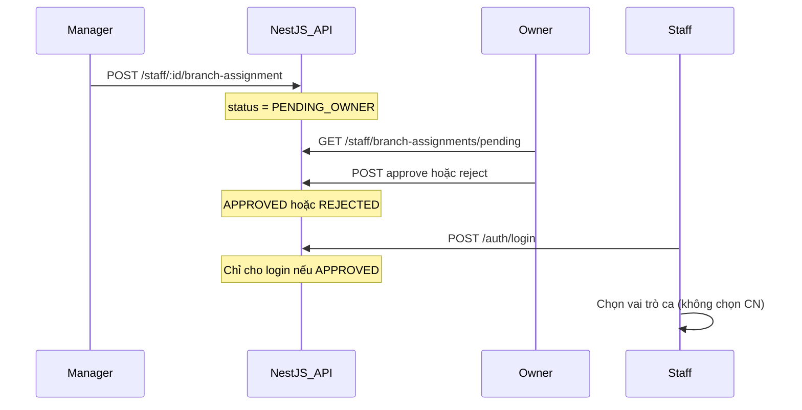

# Gán chi nhánh — Quy trình duyệt

**Version:** 1.0  
**Nguyên tắc:** Nhân viên **không tự chọn** chi nhánh. Quản lý đề xuất → Chủ quán duyệt.

---

## 1. Luồng nghiệp vụ



| Bước | Ai            | Hành động                                                   |
| ---- | ------------- | ----------------------------------------------------------- |
| 1    | **Quản lý**   | Đề xuất gán nhân viên vào chi nhánh (bất kỳ CN nào)         |
| 2    | Hệ thống      | `branchAssignmentStatus = PENDING_OWNER`                    |
| 3    | **Chủ quán**  | Duyệt hoặc từ chối                                          |
| 4    | Hệ thống      | `APPROVED` → nhân viên login được · `REJECTED` → chặn login |
| 5    | **Nhân viên** | Login → **không** chọn CN → chọn vai trò ca                 |

---

## 2. Trạng thái (`BranchAssignmentStatus`)

| Status          | Ý nghĩa               | Nhân viên login?      |
| --------------- | --------------------- | --------------------- |
| `NONE`          | Chưa được quản lý gán | ❌                    |
| `PENDING_OWNER` | Chờ chủ quán duyệt    | ❌                    |
| `APPROVED`      | Đã duyệt              | ✅ (CN cố định từ DB) |
| `REJECTED`      | Bị từ chối            | ❌                    |

---

## 3. API

| Method | Endpoint                                      | Role           |
| ------ | --------------------------------------------- | -------------- |
| GET    | `/api/v1/staff`                               | MANAGER, OWNER |
| POST   | `/api/v1/staff/:id/branch-assignment`         | MANAGER, OWNER |
| POST   | `/api/v1/staff/:id/branch-assignment/approve` | OWNER          |
| POST   | `/api/v1/staff/:id/branch-assignment/reject`  | OWNER          |
| GET    | `/api/v1/staff/branch-assignments/pending`    | OWNER          |

Body đề xuất: `{ "branchId": "uuid" }`

---

## 4. Mobile

| User                        | Sau login                                                          |
| --------------------------- | ------------------------------------------------------------------ |
| CASHIER / BARISTA / MANAGER | CN từ assignment đã duyệt → **Chọn vai trò**                       |
| OWNER                       | **Chọn chi nhánh phiên** (xem báo cáo đa CN) — không phải “tự gán” |

| Màn hình                | Ai             | Đường dẫn                     |
| ----------------------- | -------------- | ----------------------------- |
| Gán chi nhánh nhân viên | MANAGER, OWNER | `/(manager)/staff`            |
| Duyệt gán chi nhánh     | OWNER          | `/(manager)/branch-approvals` |

Màn `02-chon-chi-nhanh` design: **chỉ dùng cho chủ quán** (phiên làm việc).

---

## 5. Thông báo lỗi login

| Tình huống | Message                                  |
| ---------- | ---------------------------------------- |
| Chưa gán   | Chưa được quản lý gán chi nhánh...       |
| Chờ duyệt  | Đang chờ chủ quán duyệt gán chi nhánh... |
| Bị từ chối | Gán chi nhánh bị từ chối...              |

---

## 6. Demo seed

Tài khoản `cashier@`, `barista@`, `manager@` — `APPROVED` + CN Quận 1.

Chạy lại seed sau migration:

```powershell
npm run db:seed --workspace=@caffeapp/api
```
