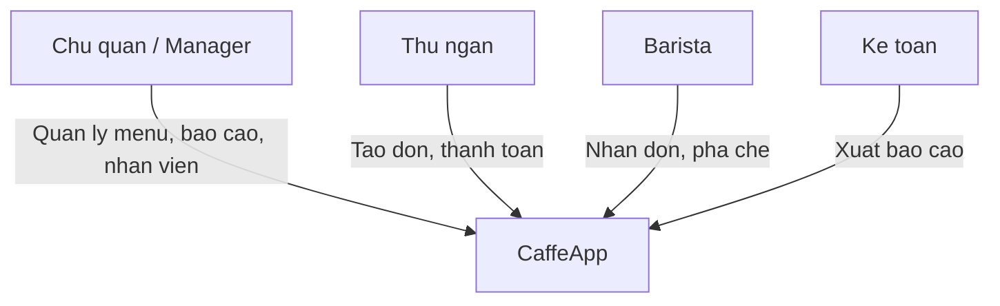

# CaffeApp — Discovery & Business Analysis

## 1. Business Case

### Vấn đề

Quán cafe nhỏ (1–3 chi nhánh) đang vận hành bằng giấy + Excel hoặc POS generic không tối ưu cho workflow pha chế:

- Thu ngân ghi đơn sai, barista không thấy ghi chú (ít đường, ít đá)
- Không biết bàn nào trống/đang dùng theo thời gian thực
- Chủ quán không có báo cáo doanh thu theo ca/giờ ngay trong ngày

### Giải pháp

App mobile nội bộ cho 3 vai trò: **Thu ngân**, **Barista**, **Quản lý** — đồng bộ đơn real-time trong cùng chi nhánh.

### Ai trả tiền / dùng

| Stakeholder   | Vai trò                 | Pain point chính              |
| ------------- | ----------------------- | ----------------------------- |
| Chủ quán      | Quản lý, quyết định mua | Không có số liệu real-time    |
| Thu ngân      | Tạo đơn, thu tiền       | Ghi sai đơn, chậm khi ca đông |
| Barista       | Pha chế                 | Không thấy đơn mới kịp thời   |
| Kế toán (phụ) | Đối soát cuối ngày      | Xuất báo cáo thủ công         |

### ROI dự kiến (MVP pilot 1 chi nhánh)

- Giảm thời gian tạo đơn: từ ~60s xuống < 30s
- Giảm sai đơn do ghi chú rõ ràng: mục tiêu -50%
- Barista nhận đơn trong < 3s sau khi thu ngân gửi bếp

---

## 2. Stakeholder Map

---

## 3. Competitive Analysis

| Sản phẩm         | Điểm mạnh                               | Điểm yếu vs CaffeApp                  |
| ---------------- | --------------------------------------- | ------------------------------------- |
| KiotViet F&B     | Đầy đủ tính năng, in hóa đơn            | Phức tạp, chi phí cao cho quán nhỏ    |
| Sapo             | POS + kho                               | Không tối ưu workflow barista         |
| iPOS / Misa      | Phổ biến VN                             | UI cũ, không mobile-first             |
| **CaffeApp MVP** | Mobile-first, 3 role, real-time barista | Chưa có in hóa đơn, 1 chi nhánh pilot |

---

## 4. Success Metrics (KPIs)

| KPI                    | Baseline (giấy) | Target MVP | Cách đo                         |
| ---------------------- | --------------- | ---------- | ------------------------------- |
| Thời gian tạo đơn      | ~60s            | < 30s      | Timestamp từ chọn bàn → gửi bếp |
| Độ trễ đơn tới barista | N/A (gọi miệng) | < 3s       | Server timestamp diff           |
| Tỷ lệ sai đơn          | ~10% (ước tính) | < 5%       | Feedback chủ quán sau 2 tuần    |
| Uptime trong ca        | N/A             | 99%        | Monitoring staging/prod         |

---

## 5. MVP Scope — MoSCoW

### Must Have (Sprint 1–4)

- Đăng nhập, chọn chi nhánh, chọn vai trò (A)
- Tạo đơn tại bàn/mang đi, sơ đồ bàn, menu, giỏ hàng (B)
- Thanh toán tiền mặt + chuyển khoản (B)
- Barista queue real-time, pha chế, hoàn thành (C)
- Dashboard doanh thu cơ bản (D)

### Should Have (Sprint 5–6)

- Thanh toán thẻ, ví điện tử (B)
- Quản lý menu, nhân viên (D)
- Thông báo, cài đặt (E)

### Could Have (Post-MVP)

- Multi-branch đồng bộ
- In hóa đơn Bluetooth
- Offline-first với sync

### Won't Have (MVP)

- Loyalty / tích điểm khách
- Đặt bàn online từ khách
- Kho nguyên liệu chi tiết

---

## 6. Pilot Decision

**Quyết định:** Bắt đầu **1 chi nhánh pilot** (Quận 1), schema DB hỗ trợ multi-branch nhưng UI/API filter theo `branch_id` đã chọn.

**Pain points cần validate tại quán (checklist site visit):**

- [ ] Số bàn thực tế và layout tầng
- [ ] Menu hiện tại (số món, size, topping)
- [ ] Phương thức thanh toán phổ biến
- [ ] Số thiết bị (mấy máy thu ngân, mấy máy barista)
- [ ] Wifi/4G ổn định trong quán

---

## Sign-off

| Vai trò       | Trạng thái                | Ngày       |
| ------------- | ------------------------- | ---------- |
| Product Owner | Approved (MVP scope)      | 2026-06-25 |
| Tech Lead     | Approved (1 branch pilot) | 2026-06-25 |
