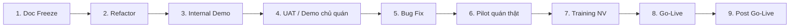

# CaffeApp — Kế hoạch Refactor → Go-Live

**Mục đích:** Lộ trình từ Documentation Freeze đến vận hành chính thức tại quán thật.  
**Nguồn nghiệp vụ:** [STAKEHOLDER_QUESTIONNAIRE.md](STAKEHOLDER_QUESTIONNAIRE.md) (MVP v2) · [PRD.md](PRD.md) · [SPRINT_PLAN.md](SPRINT_PLAN.md)  
**Phiên bản:** 2.0.0  
**Cập nhật:** 2026-06-29  
**Trạng thái:** Questionnaire đã chốt khách — **Phase 1 đóng** → Phase 2 (P2-01–04 ✅; C-15, Sprint 2–3 pending)

**Liên kết:** [RELEASE.md](RELEASE.md) · [DEPLOYMENT.md](DEPLOYMENT.md) · [TESTING.md](TESTING.md) · [DEVICE_POLICY.md](DEVICE_POLICY.md) · **[GO_LIVE_PROMPTS_FULL.md](GO_LIVE_PROMPTS_FULL.md)** ← 183 prompt theo questionnaire

---

## Tổng quan

Docs đã sync MVP v2 (2026-06-29). Code còn lệch — xem [Phần L](STAKEHOLDER_QUESTIONNAIRE.md#phần-l--checklist-sau-khi-điền-xong) và [MOBILE_ARCHITECTURE.md](MOBILE_ARCHITECTURE.md). Kế hoạch này bắt đầu **sau doc sync**, trước vận hành tại **3 chi nhánh** (~50 bàn/CN, 2 NV/CN).



**Nguyên tắc:** Không chuyển phase khi checklist chưa đạt. Mỗi phase có **gate review** (TPM + Tech Lead + Owner/QL khi liên quan nghiệp vụ).

### Cách dùng Prompt giao việc

| Tài liệu                                                    | Nội dung                                                  | Khi nào dùng                                     |
| ----------------------------------------------------------- | --------------------------------------------------------- | ------------------------------------------------ |
| **[GO_LIVE_PROMPTS_FULL.md](GO_LIVE_PROMPTS_FULL.md)**      | **183 prompt** map 1:1 questionnaire A→I + GAP + US + UAT | Giao dev/AI **theo từng ID** (A-01, D-17, C-11…) |
| [Phụ lục A](#phụ-lục--prompt-giao-việc-chi-tiết) (file này) | Prompt **theo Phase** + TASK-P2-xx chi tiết coding        | Lộ trình refactor → go-live                      |

Mỗi task có:

| Trường       | Ý nghĩa                                                                      |
| ------------ | ---------------------------------------------------------------------------- |
| **ID**       | `TASK-Q-{questionnaire-id}` hoặc `TASK-P{n}-{nn}` — dùng làm ticket / branch |
| **Giao cho** | Vai trò chịu trách nhiệm                                                     |
| **Loại**     | `code` · `seed` · `ops` · `qa` · `doc` · `defer`                             |
| **Prompt**   | Copy block `text` → Cursor Agent                                             |

**Quy trình giao việc:**

1. Tìm ID trong [Master Index](GO_LIVE_PROMPTS_FULL.md#master-index) (vd. `D-17`, `B-14`).
2. Copy prompt `TASK-Q-D-17` → Agent; hoặc dùng `TASK-P2-09` nếu là epic Sprint 2.
3. Output: PR + tick checklist phase + cập nhật cột Status trong index (nếu xong).
4. Thay đổi nghiệp vụ → questionnaire + PO trước khi code (DOC_FREEZE_MEMO).

**Regenerate prompts** (sau khi sửa questionnaire): `node scripts/generate-go-live-prompts.mjs`

---

## Phase 1 — Documentation Freeze

### Mục tiêu

Khóa bộ tài liệu làm **single source of truth** trước refactor; tránh dev theo doc cũ hoặc doc đang sửa song song.

### Việc cần làm

- Chốt version tag docs: `docs-v2.0-mvp` (PRD, USER_STORIES, API_CONTRACT, ERD, DEVICE_POLICY, BRANCH_ASSIGNMENT, TESTING).
- Rà soát **Phần J (GAP)**: GAP-07 (OpenAPI), GAP-08 (design PNG commit) — gán owner + deadline.
- Bổ sung thông tin còn trống P0: tên/địa chỉ CN pilot (A-01), ngày pilot cụ thể (H-08).
- Ghi **changelog nội bộ** (Phần L): thông báo team về C-11, B-18, GAP-05.
- Freeze rule: mọi thay đổi nghiệp vụ sau freeze → ticket + PO approve + cập nhật questionnaire trước khi code.

### Prompt giao việc

→ [Phase 1 — TASK-P1-01 → P1-05](#phase-1--prompt-giao-việc)

### Người tham gia

| Vai trò           | Trách nhiệm                          |
| ----------------- | ------------------------------------ |
| **PO / Chủ quán** | Chốt P0 còn trống, ký freeze         |
| **TPM**           | Điều phối, gate checklist            |
| **Tech Lead**     | Xác nhận API/ERD khớp refactor scope |
| **Designer**      | Commit PNG design vào repo (GAP-08)  |

### Output

- Bản **Doc Freeze Memo** ([DOC_FREEZE_MEMO.md](DOC_FREEZE_MEMO.md) — ngày freeze 2026-06-29, tag `docs-v2.0-mvp`).
- GAP tracker cập nhật (doc vs code) — Phần J questionnaire.
- Changelog nội bộ gửi team — [CHANGELOG.md](../CHANGELOG.md).
- API/ERD refactor checklist — [API_ERD_REFACTOR_CHECKLIST.md](API_ERD_REFACTOR_CHECKLIST.md).

### Checklist hoàn thành

- [x] Tất cả câu P0 trong questionnaire có trả lời
- [x] PRD / USER_STORIES / API_CONTRACT / ERD cùng version MVP v2
- [x] GAP-01 → GAP-10 có owner; doc gaps = ✅ hoặc có deadline
- [x] Design assets: dev bám **design cũ** (`design/DESIGN_SYSTEM.md`, `design/screens/INDEX.md`) — PNG commit khi có (GAP-08 waived pilot)
- [x] Không còn mâu thuẫn doc-doc (xác nhận lại sau sync 2026-06-29)
- [x] Team acknowledge freeze (Slack/email/meeting note) — [CHANGELOG.md](../CHANGELOG.md)

### Rủi ro

| Rủi ro                         | Mitigation                                            |
| ------------------------------ | ----------------------------------------------------- |
| Chủ quán đổi scope giữa freeze | Change control: impact assessment trước khi mở freeze |
| Design PNG thiếu               | Block Sprint 2+ UI; ưu tiên màn pilot (01–15) trước   |
| OpenAPI chưa generate          | Không block refactor; block trước partner integration |

### Điều kiện chuyển Phase 2

**100% P0 questionnaire đã chốt** + **Doc Freeze Memo được PO/Tech Lead ký** + **không còn GAP doc-doc mở**.

---

## Phase 2 — Code Refactor

### Mục tiêu

Đưa codebase khớp docs đã freeze — xóa technical debt đã ghi nhận trước khi demo/UAT.

### Việc cần làm

**2.1 Auth & routing (C-11, US-A03)**

- Bỏ / bypass `(auth)/role.tsx`; điều hướng theo `StaffRole` từ `GET /auth/me`.
- Owner: flow chọn CN phiên; Staff: vào CN đã gán, không chọn CN.

**2.2 Order lifecycle (GAP-05, B-33, F-12)**

- Gỡ enum `SERVING`; dùng `deliveredAt` + endpoint "Đã giao".
- Luồng: `PENDING → MAKING → READY → (delivered) → PAID`.

**2.3 Device policy v2 (A-09, B-15)**

- Tablet trạm: session chung + **picker chọn NV** mỗi thao tác quan trọng.
- ĐT cá nhân: login riêng; auto-logout cuối ca (+10p).

**2.4 Payment & VAT (D-17, E-09)**

- Bill tách dòng VAT 8% (giá đã gồm).
- Pilot: TM + CK VietQR; không VNPay Sandbox tại quán thật.

**2.5 Hạ tầng dev**

- E2E C-15: login thiết bị thật + SecureStore sau kill app.
- Migration DB cho `delivered_at`; data migration nếu có order `SERVING` cũ.
- Unit/integration test cho auth, order status, payment.

**2.6 Phạm vi MVP v2 (theo sprint — nếu chưa code)**

- Sprint 4: WebSocket bếp + fallback polling 10s.
- Sprint 5: Shift module bắt buộc, dashboard QL, audit UI.
- Sprint 6: gộp/tách/chuyển bàn (B-30), giảm giá (B-31), notification.

> **Khuyến nghị:** Refactor **trước** feature mới. Tách PR: (1) auth routing, (2) deliveredAt, (3) tablet NV picker, (4) VAT.

### Prompt giao việc

→ **FULL (183 ID):** [GO_LIVE_PROMPTS_FULL.md](GO_LIVE_PROMPTS_FULL.md)  
→ **Theo phase:** [Phase 2 — TASK-P2-01 → P2-12](#phase-2--prompt-giao-việc) (coding chi tiết)

### Người tham gia

| Vai trò         | Trách nhiệm                               |
| --------------- | ----------------------------------------- |
| **Backend dev** | API, Prisma migration, audit log          |
| **Mobile dev**  | Routing, tablet UX, order/payment screens |
| **QA**          | Regression test plan, E2E C-15            |
| **Tech Lead**   | Code review, ADR cập nhật nếu cần         |
| **DevOps**      | Staging env sẵn sàng                      |

### Output

- PR merged: refactor scope P0 (auth, SERVING, tablet picker, VAT).
- Migration script + rollback script DB.
- Test report: unit/integration pass; E2E C-15 pass trên Android tablet + phone.
- `MOBILE_ARCHITECTURE.md` status: refactor items ✅.

### Checklist hoàn thành

- [x] Không còn route/màn chọn role trong build staging (TASK-P2-01 ✅ 2026-06-29)
- [x] Không còn `SERVING` trong shared enums / API response (TASK-P2-02 ✅ 2026-06-29)
- [x] `deliveredAt` set khi NV ấn "Đã giao"; audit ghi NV + thiết bị (`POST /orders/:id/deliver`)
- [x] Tablet trạm: picker NV trên tạo đơn, thanh toán, hủy (TASK-P2-03 ✅ 2026-06-29)
- [x] Tablet trạm: **Tab Bếp** — hoàn thành món (MAKING → READY), giống ĐT barista (TASK-P2-03b ✅ 2026-06-29)
- [x] VAT 8% hiển thị đúng trên bill (TASK-P2-04 ✅ 2026-06-29)
- [ ] C-15 E2E pass thiết bị thật
- [x] CI green local (format + lint + typecheck + test) — 2026-06-30
- [ ] Staging deploy với menu/bàn seed thật (I-03) — script `db:seed:staging` ✅ 2026-06-29; chạy trên staging DB

### Rủi ro

| Rủi ro                            | Mitigation                                                |
| --------------------------------- | --------------------------------------------------------- |
| Migration `SERVING` làm hỏng data | Backup staging; script map SERVING → READY + deliveredAt  |
| Refactor kéo dài, trễ pilot       | Scope freeze: chỉ P0 refactor; MVP v2 feature theo sprint |
| Tablet UX phức tạp                | UAT sớm picker NV với 2 NV thật tại quầy                  |

### Điều kiện chuyển Phase 3

**Staging build** chạy full luồng: Login → Order → Bếp → Đã giao → TM/CK → PAID **không lỗi critical** + **E2E C-15 pass**.

---

## Phase 3 — Internal Demo

### Mục tiêu

Xác nhận nội bộ (dev + PO + design) rằng sản phẩm đáp ứng user stories pilot **trước khi đưa chủ quán test**.

### Việc cần làm

- Chuẩn bị **demo script** 30–45 phút (5 luồng chính).
- Demo trên **staging** với data giống quán thật: 50 bàn, ~40 món, 3 CN.
- Ghi **demo minutes**: bug, UX feedback, scope gap.
- Kiểm tra NFR spot-check: API p95 trên WiFi mô phỏng quán (H-12).
- Review copy tiếng Việt nội bộ (H-13 — bản nháp).

### Prompt giao việc

→ [Phase 3 — TASK-P3-01 → P3-05](#phase-3--prompt-giao-việc)

### Người tham gia

| Vai trò      | Trách nhiệm             |
| ------------ | ----------------------- |
| **Dev team** | Demo + ghi nhận bug     |
| **PO / TPM** | Chấm acceptance theo US |
| **Designer** | UX review so với PNG    |
| **QA**       | Ghi defect, severity    |

### Output

- Repo-side demo pack: [DEMO_SCRIPT_INTERNAL.md](DEMO_SCRIPT_INTERNAL.md), [DEMO_MINUTES_TEMPLATE.md](DEMO_MINUTES_TEMPLATE.md), [STAGING_DATA_CHECKLIST.md](STAGING_DATA_CHECKLIST.md), [NFR_SPOT_CHECK.md](NFR_SPOT_CHECK.md), [COPY_REVIEW_PHASE3.md](COPY_REVIEW_PHASE3.md).
- Demo recording / screenshots.
- Defect list có severity.
- Go/No-Go nội bộ memo.

### Checklist hoàn thành

> Repo-side preparation đã xong 2026-06-30. Gate Phase 3 vẫn chưa tick cho đến khi chạy demo thật trên staging/tablet, có evidence, NFR log và PO approve.

- [ ] 5 luồng demo pass không crash:
  1. Owner login + chọn CN
  2. Staff tablet: order bàn → gửi bếp (chọn NV)
  3. Bếp: MAKING → READY → Đã giao
  4. Thanh toán TM + CK (VietQR)
  5. Manager xem đơn / doanh thu ca (nếu Sprint 5 done)
- [ ] Không bug **Critical/High** mở
- [ ] UI khớp design ≥ 90% màn pilot (01–15)
- [ ] Offline policy: thông báo rõ khi mất mạng (B-18)
- [ ] PO nội bộ approve "sẵn sàng UAT"

### Rủi ro

| Rủi ro                               | Mitigation                              |
| ------------------------------------ | --------------------------------------- |
| Demo trên emulator, khác tablet thật | Bắt buộc 1 run trên tablet Android thật |
| Performance chậm giờ cao điểm        | Load test nhẹ: 20 order đồng thời       |

### Điều kiện chuyển Phase 4

**0 Critical, ≤ 3 High** (có workaround) + **PO approve UAT** + **staging ổn định 48h**.

---

## Phase 4 — UAT / Demo cho chủ quán test

### Mục tiêu

Chủ quán + QL CN pilot **xác nhận nghiệp vụ** trên môi trường gần production, **tối thiểu 15 kịch bản** (H-09).

### Việc cần làm

- Lên lịch UAT 2–3 buổi (2–4 giờ/buổi) tại quán hoặc phòng demo có WiFi + tablet.
- Cài **internal build** (EAS) lên tablet trạm + ĐT Owner/QL.
- Chạy [UAT Checklist](#uat-checklist-15-kịch-bản) (H-09).
- Owner + QL chấm Pass/Fail từng kịch bản; ghi video lỗi.
- Review copy tiếng Việt cuối (H-13).

### Prompt giao việc

→ [Phase 4 — TASK-P4-01 → P4-06](#phase-4--prompt-giao-việc)

### Người tham gia

| Vai trò         | Trách nhiệm                     |
| --------------- | ------------------------------- |
| **Owner**       | Chấm UAT, quyết định nghiệp vụ  |
| **QL CN pilot** | Chạy kịch bản vận hành          |
| **TPM**         | Điều phối, ghi nhận             |
| **Dev on-call** | Sửa lỗi nhỏ tại chỗ (nếu có)    |
| **QA**          | Ghi defect, tổng hợp UAT report |

### Output

- Repo-side UAT pack: [UAT_SIGNOFF_SHEET.md](UAT_SIGNOFF_SHEET.md), [UAT_REPORT_TEMPLATE.md](UAT_REPORT_TEMPLATE.md), EAS `preview` profile, `phase4:release-ready`.
- **UAT Sign-off Sheet** (15+ kịch bản, Pass/Fail, chữ ký Owner).
- UAT Report: defect theo severity.
- Danh sách thay đổi nghiệp vụ (nếu phát sinh) → change request.

### Checklist hoàn thành

> Repo-side preparation đã xong 2026-06-30. Gate Phase 4 vẫn pending cho đến khi Owner/QL chạy UAT thật và ký sign-off.

- [ ] ≥ 15/15 kịch bản executed
- [ ] ≥ 90% kịch bản **Pass** (fail chỉ được Low/Medium có kế hoạch fix)
- [ ] Owner xác nhận: TM + CK đủ cho pilot; không cần Thẻ/Ví giai đoạn đầu
- [ ] Tablet trạm + chọn NV được NV quán chấp nhận
- [ ] Menu thật, STK CK, 50 bàn đúng layout quán
- [ ] Không lỗi Critical trong buổi UAT

### Rủi ro

| Rủi ro                         | Mitigation                                |
| ------------------------------ | ----------------------------------------- |
| Owner đổi yêu cầu lớn giữa UAT | Ghi CR; phân loại pilot vs post-pilot     |
| WiFi quán khác staging         | Test trực tiếp WiFi quán trong UAT buổi 1 |
| NV không quen tablet           | Phase 7 training sớm 1 buổi preview       |

### Điều kiện chuyển Phase 5

**UAT Sign-off** (Owner + QL) + **0 Critical mở** + **≤ 5 Medium** có ticket và ETA.

---

## Phase 5 — Bug Fix

### Mục tiêu

Xử lý toàn bộ defect từ Internal Demo + UAT trước pilot; đạt chất lượng theo [Bug Severity Rule](#bug-severity-rule).

### Việc cần làm

- Triage hàng ngày: Critical → fix trong 24h; High → 3 ngày; Medium → trước pilot.
- Regression test sau mỗi fix batch.
- Re-UAT các kịch bản fail (smoke 5 kịch bản core).
- Chuẩn bị release candidate `v1.0.0-rc.1` (theo [RELEASE.md](RELEASE.md)).

### Prompt giao việc

→ [Phase 5 — TASK-P5-01 → P5-05](#phase-5--prompt-giao-việc)

### Người tham gia

| Vai trò      | Trách nhiệm              |
| ------------ | ------------------------ |
| **Dev team** | Fix + PR                 |
| **QA**       | Regression, verify fix   |
| **TPM**      | Theo dõi burndown defect |
| **Owner**    | Re-sign smoke UAT        |

### Output

- Repo-side RC pack: [RELEASE_CANDIDATE_CHECKLIST.md](RELEASE_CANDIDATE_CHECKLIST.md), [PRODUCTION_BACKUP_RUNBOOK.md](PRODUCTION_BACKUP_RUNBOOK.md), `db:backup:pg`, `phase4:release-ready`.
- Release candidate build.
- Defect burndown chart.
- Regression test report.

### Checklist hoàn thành

> Tooling RC/backup đã sẵn sàng 2026-06-30. Fix bug thật vẫn phụ thuộc defect từ Internal Demo/UAT.

- [ ] 0 Critical, 0 High mở
- [ ] Medium: 100% fix hoặc accepted waiver (Owner ký)
- [ ] Low: ≥ 80% fix; còn lại backlog post-pilot
- [ ] Smoke UAT 5 kịch bản core: Pass
- [ ] `CHANGELOG.md` cập nhật
- [ ] Production env + DB backup strategy sẵn sàng

### Rủi ro

| Rủi ro                     | Mitigation                                             |
| -------------------------- | ------------------------------------------------------ |
| Fix regression tạo bug mới | Bắt buộc regression suite; freeze code 48h trước pilot |
| Trễ deadline pilot         | Giảm scope: hoãn B-31 voucher nếu chưa stable          |

### Điều kiện chuyển Phase 6

**RC build signed off** + **0 Critical/High** + **production deployed** + **rollback plan tested trên staging**.

---

## Phase 6 — Pilot tại quán thật

### Mục tiêu

Vận hành thử **CN pilot (CN1)** trong **2 tuần** (A-11); song song giấy **3–5 ngày** đầu (H-08); đo ổn định trước mở rộng CN2/CN3.

### Việc cần làm

- **Ngày D0:** Go-live CN1 (xem [Go-Live Checklist](#go-live-checklist)).
- Ca làm thật: 3 ca × 8h; tablet trạm + 2 NV.
- **Hypercare:** dev on-call giờ mở cửa; SLA Critical **4 giờ** (H-10).
- Theo dõi KPI hàng ngày: số đơn, lỗi, thời gian order→PAID, đối chiếu TM/CK cuối ca.
- Ngày 3–5: giảm song song giấy → thuần app.
- Ngày 7: **go/no-go CN2** (H-11).
- Tuần 2: mở CN2 nếu đạt; chuẩn bị CN3.

### Prompt giao việc

→ [Phase 6 — TASK-P6-01 → P6-05](#phase-6--prompt-giao-việc)

### Người tham gia

| Vai trò               | Trách nhiệm                  |
| --------------------- | ---------------------------- |
| **NV quán (2/CN)**    | Vận hành hàng ngày           |
| **QL CN**             | Kết ca, đối chiếu TM/CK      |
| **Owner**             | Giám sát, quyết định mở rộng |
| **TPM + Dev on-call** | Incident response            |
| **QA**                | Ghi defect từ quán           |

### Output

- Repo-side pilot pack: [PILOT_DAILY_LOG_TEMPLATE.md](PILOT_DAILY_LOG_TEMPLATE.md), [ON_CALL_ROSTER_TEMPLATE.md](ON_CALL_ROSTER_TEMPLATE.md), [GO_NO_GO_MEMO_TEMPLATE.md](GO_NO_GO_MEMO_TEMPLATE.md).
- Pilot daily log (7–14 ngày).
- Báo cáo đối chiếu TM/CK cuối ca.
- Go/No-Go memo CN2/CN3.

### Checklist hoàn thành

> Templates đã sẵn sàng 2026-06-30. KPI, daily log và go/no-go vẫn phải ghi khi pilot tại quán thật.

- [ ] 7 ngày liên tục CN1 không Critical mở (H-11)
- [ ] ≥ 95% đơn trong ca xử lý qua app (sau ngày 5)
- [ ] Đối chiếu TM/CK cuối ca: chênh lệch < ngưỡng Owner chốt
- [ ] Không mất đơn / duplicate payment
- [ ] NV phản hồi: "có thể làm việc" (survey 1–5)
- [ ] Owner ký Go mở CN2

### Rủi ro

| Rủi ro                         | Mitigation                                    |
| ------------------------------ | --------------------------------------------- |
| Mất mạng giờ cao điểm (18–22h) | Quy trình thủ công in sẵn (B-18); hotline dev |
| NV resistance                  | Training Phase 7 song song ngày 1–3           |
| Data sai do seed menu          | Lock menu sau ngày 3; change qua Owner        |

### Điều kiện chuyển Phase 7 → 8

**7 ngày ổn định CN1** + **0 Critical** + **Owner approve Go-Live đủ 3 CN**.

> **Lưu ý:** Training (Phase 7) có thể **overlap** ngày 1–3 pilot CN1.

---

## Phase 7 — Training nhân viên

### Mục tiêu

Đảm bảo mọi NV tại CN triển khai **tự vận hành** app không cần dev đứng cạnh.

### Việc cần làm

- Soạn tài liệu training 1–2 trang + video ngắn (5–10 phút/luồng).
- Đào tạo theo vai trò: Thu ngân/Pha chế (tablet), QL (kết ca, audit), Owner (đa CN).
- Thực hành có giám sát: mỗi NV hoàn thành **5 thao tác bắt buộc**.
- Bài kiểm tra nhanh (quiz 10 câu hoặc checklist thực hành).

### Prompt giao việc

→ [Phase 7 — TASK-P7-01 → P7-04](#phase-7--prompt-giao-việc)

### Người tham gia

| Vai trò      | Trách nhiệm            |
| ------------ | ---------------------- |
| **QL CN**    | Trainer chính tại quán |
| **TPM / PO** | Tài liệu, slide        |
| **Dev**      | Hỗ trợ kỹ thuật buổi 1 |
| **NV**       | Tham gia + ký xác nhận |

### Output

- Repo-side training pack: [TRAINING_PACK.md](TRAINING_PACK.md), [SOP_QUAY_PILOT.md](SOP_QUAY_PILOT.md).
- Training pack (PDF/video).
- Attendance + competency checklist ký từng NV.
- FAQ nội bộ (mất mạng, quên chọn NV, CK chưa về).

### Checklist hoàn thành

> Source tài liệu đã sẵn sàng 2026-06-30. In PDF/video/training và NV ký là phần thủ công.

- [ ] 100% NV CN pilot trained trước Go-Live CN đó
- [ ] Mỗi NV pass [5 thao tác bắt buộc](#training-checklist)
- [ ] QL biết kết ca + đối chiếu TM/CK
- [ ] NV biết quy trình mất mạng → thủ công
- [ ] Có **key user** mỗi CN (QL hoặc senior NV)

### Rủi ro

| Rủi ro               | Mitigation                          |
| -------------------- | ----------------------------------- |
| NV ca tối chưa train | Lịch 2 ca training; video on-demand |
| Quên chọn tên NV     | Nhắc UI + QL audit cuối ca          |

### Điều kiện chuyển Phase 8

**100% NV CN target đã trained & competent** + **key user designated**.

---

## Phase 8 — Go-Live

### Mục tiêu

Triển khai **production** chính thức — ban đầu CN1 (pilot), mở rộng **CN2 → CN3** theo gate H-11.

### Việc cần làm

- Deploy production API + DB; EAS production build.
- Cấu hình: `EXPO_PUBLIC_API_URL` prod, SSL, backup tự động.
- Import data: 3 CN, 50 bàn/CN, menu thật, tài khoản StaffRole.
- Cutover: monitor 24h đầu.
- Thông báo Owner/NV: giờ G, quy trình hỗ trợ.

### Prompt giao việc

→ [Phase 8 — TASK-P8-01 → P8-08](#phase-8--prompt-giao-việc)

### Người tham gia

| Vai trò         | Trách nhiệm        |
| --------------- | ------------------ |
| **DevOps**      | Deploy, monitor    |
| **Tech Lead**   | Go/No-Go kỹ thuật  |
| **Owner**       | Go/No-Go nghiệp vụ |
| **TPM**         | War room 24h đầu   |
| **On-call dev** | Incident           |

### Output

- Repo-side go-live pack: [PRODUCTION_DATA_CHECKLIST.md](PRODUCTION_DATA_CHECKLIST.md), [GO_LIVE_ANNOUNCEMENT_TEMPLATE.md](GO_LIVE_ANNOUNCEMENT_TEMPLATE.md), `phase8:smoke`, EAS `production` profile.
- Production release `v1.0.0`.
- Go-Live announcement.
- Monitoring dashboard (API health, error rate).

### Checklist hoàn thành

Xem [Go-Live Checklist](#go-live-checklist).

> Go-live tooling đã sẵn sàng 2026-06-30. Production deploy/build/import/war room vẫn phải chạy bằng secrets và hạ tầng thật.

### Rủi ro

| Rủi ro                | Mitigation                            |
| --------------------- | ------------------------------------- |
| Deploy lỗi production | [Rollback Plan](#rollback-plan)       |
| 3 CN cùng lúc quá tải | Rollout tuần tự CN1 → CN2 (+7d) → CN3 |

### Điều kiện chuyển Phase 9

**Go-Live checklist 100%** + **24h đầu không Critical** + **war room đóng**.

---

## Phase 9 — Post Go-Live Support

### Mục tiêu

**Hypercare 2–4 tuần** sau Go-Live; ổn định vận hành, xử lý defect, chuẩn bị MVP v2.1.

### Việc cần làm

- On-call rotation: Critical 4h, High 1 ngày làm việc (H-10).
- Weekly review Owner + TPM: defect, feedback, KPI.
- Patch release `v1.0.x` cho bug fix.
- Thu thập baseline: đơn/giờ cao điểm (A-05).
- Lên backlog post-pilot: combo, Grab, in hóa đơn, dark mode…

### Prompt giao việc

→ [Phase 9 — TASK-P9-01 → P9-04](#phase-9--prompt-giao-việc)

### Người tham gia

| Vai trò                   | Trách nhiệm     |
| ------------------------- | --------------- |
| **Support / Dev on-call** | Incident        |
| **TPM**                   | Weekly report   |
| **Owner**                 | Ưu tiên backlog |
| **QA**                    | Verify patch    |

### Output

- Repo-side hypercare pack: [WEEKLY_STABILITY_REPORT_TEMPLATE.md](WEEKLY_STABILITY_REPORT_TEMPLATE.md), [POSTMORTEM_TEMPLATE.md](POSTMORTEM_TEMPLATE.md), [ROADMAP_V2_1_TEMPLATE.md](ROADMAP_V2_1_TEMPLATE.md).
- Weekly stability report (4 tuần).
- Post-mortem nếu có incident Critical.
- Roadmap v2.1.

### Checklist hoàn thành (kết thúc hypercare)

> Hypercare templates đã sẵn sàng 2026-06-30. Patch release và roadmap cuối phụ thuộc issue/feedback thật sau go-live.

- [ ] 4 tuần liên tục 0 Critical
- [ ] 3 CN vận hành thuần app
- [ ] Owner sign-off **ổn định vận hành**
- [ ] Tài liệu vận hành (SOP) bàn giao QL
- [ ] Knowledge transfer: on-call → QL key user

### Rủi ro

| Rủi ro       | Mitigation                         |
| ------------ | ---------------------------------- |
| Team rút sớm | Cam kết hypercare tối thiểu 2 tuần |
| Bug tích lũy | Weekly patch release               |

### Điều kiện kết thúc dự án pilot

**Owner sign-off** + chuyển sang **BAU support** (maintenance contract hoặc sprint tiếp theo).

---

## Timeline đề xuất

Giả định: team ~1–2 dev + QA part-time; velocity ~20 pts/sprint. **Tuần 0 = Doc Freeze.**

| Tuần      | Phase | Hoạt động chính                              | Milestone           |
| --------- | ----- | -------------------------------------------- | ------------------- |
| **0**     | 1     | Doc freeze, GAP-08, changelog                | Doc Freeze Memo     |
| **1–2**   | 2     | Refactor P0 (auth, deliveredAt, tablet, VAT) | Staging RC internal |
| **3**     | 2     | Hoàn thiện Sprint 2–3 nếu thiếu; E2E C-15    | Refactor complete   |
| **4**     | 3     | Internal demo + bug fix nhỏ                  | Internal Go         |
| **5**     | 4     | UAT 2 buổi với Owner/QL                      | UAT Sign-off        |
| **6**     | 5     | Bug fix + RC `v1.0.0-rc.1`                   | RC ready            |
| **7–8**   | 6 + 7 | Pilot CN1 (2 tuần) + training overlap        | 7-day gate CN2      |
| **9**     | 8     | Go-Live CN2                                  | CN2 live            |
| **10**    | 8     | Go-Live CN3                                  | 3 CN live           |
| **11–14** | 9     | Hypercare + patch `v1.0.x`                   | Owner BAU sign-off  |

**Tổng:** ~14 tuần từ Doc Freeze → kết thúc hypercare (có thể **10–12 tuần** nếu Sprint 2–3 đã gần xong).

### Bắt đầu công việc ngay (rút gọn)

```
Tuần 0:  Doc freeze + chốt P0 với chủ quán
Tuần 1–3: Refactor P0 + order/payment (nếu thiếu)
Tuần 4:  Internal demo
Tuần 5:  UAT chủ quán (15 kịch bản)
Tuần 6:  Bug fix → RC
Tuần 7+: Pilot CN1 → training → Go-Live CN2/CN3
```

**Thứ tự refactor P0:** (1) auth routing → (2) deliveredAt → (3) tablet NV picker → (4) VAT → (5) E2E C-15.

---

## Go-Live Checklist

### A. Kỹ thuật

- [ ] Production API deploy + SSL + health check `/api/v1/health`
- [ ] PostgreSQL backup tự động (daily) + restore test trong 30 ngày
- [ ] Mobile production build (EAS) — Android internal/production track
- [ ] `EXPO_PUBLIC_API_URL` trỏ production; không hard-code IP
- [ ] DB migration applied; không còn `SERVING`
- [ ] Monitoring: API error rate, latency p95, disk DB
- [ ] Rollback plan documented & tested (xem [Rollback Plan](#rollback-plan))
- [ ] On-call roster + hotline 2 tuần đầu

### B. Dữ liệu

- [ ] 3 chi nhánh + 50 bàn/CN (T1×20, T2×20, sân×10)
- [ ] Menu thật ~40 món / 6 category (D-13)
- [ ] Tài khoản: Owner, QL/CN, NV với StaffRole đúng
- [ ] STK VietQR theo CN/chủ quán
- [ ] VAT 8% cấu hình đúng

### C. Thiết bị & mạng

- [ ] 1 tablet Android/CN cài app production
- [ ] ĐT Owner + QL + NV cài app
- [ ] WiFi quán tested với app (H-12)
- [ ] Tablet đăng nhập tài khoản trạm; NV biết chọn tên khi thao tác

### D. Nghiệp vụ & con người

- [ ] UAT Sign-off (15 kịch bản)
- [ ] Training 100% NV CN target
- [ ] SOP mất mạng in tại quầy (B-18)
- [ ] SOP song song giấy 3–5 ngày (H-08)
- [ ] Owner ký Go-Live memo (ngày G, phạm vi CN)

### E. Chất lượng

- [ ] 0 Critical / 0 High mở
- [ ] Smoke test 5 luồng core trên production
- [ ] `CHANGELOG.md` + tag `v1.0.0`

---

## Bug Severity Rule

| Severity          | Định nghĩa                                          | Ví dụ                                                       | SLA                 | Block Go-Live?                  |
| ----------------- | --------------------------------------------------- | ----------------------------------------------------------- | ------------------- | ------------------------------- |
| **S1 — Critical** | Không dùng được; mất tiền/dữ liệu; không workaround | Không tạo đơn; PAID sai; mất đơn; API down > 15p giờ mở cửa | **4 giờ** (H-10)    | **Có**                          |
| **S2 — High**     | Core lỗi, có workaround tạm                         | CK không QR (ghi TM tạm); bếp không realtime                | **1 ngày làm việc** | Có nếu > 3 hoặc ảnh hưởng TM/CK |
| **S3 — Medium**   | Phụ hoặc edge case                                  | Copy sai; gộp bàn UI khó                                    | Trước hết pilot     | Không nếu Owner waiver          |
| **S4 — Low**      | Cosmetic, hiếm                                      | Typo; alignment                                             | Backlog             | Không                           |

**Pilot gate (H-11):** 0 S1 mở; mở CN2 cần **7 ngày 0 S1** tại CN1.

**Phân loại nhanh:**

- Ảnh hưởng **tiền / đơn / thanh toán** → tối thiểu S2; không workaround → S1.
- Chỉ UI/UX → S3/S4.
- Chỉ 1 thiết bị → giảm 1 bậc sau khi reproduce.

---

## UAT Checklist (15 kịch bản)

Theo H-09. Owner + QL CN pilot chấm Pass/Fail.

| #   | Kịch bản                         | Vai trò  | Pass criteria                         |
| --- | -------------------------------- | -------- | ------------------------------------- |
| 1   | Đăng nhập Owner → chọn CN        | Owner    | Dashboard Owner; không màn chọn role  |
| 2   | Đăng nhập Staff → khu vận hành   | NV       | Routing đúng StaffRole; không chọn CN |
| 3   | Phiên sau kill app (SecureStore) | NV       | Vẫn đăng nhập (C-15)                  |
| 4   | Tạo đơn tại bàn + chọn NV        | Thu ngân | PENDING; audit có tên NV              |
| 5   | Đơn mang đi + số thứ tự          | Thu ngân | Có # thứ tự (B-28)                    |
| 6   | Khóa bàn — NV thứ 2              | Thu ngân | Thông báo bàn đang dùng (B-14)        |
| 7   | Gửi bếp → MAKING → READY         | Pha chế  | Queue cập nhật                        |
| 8   | Ấn "Đã giao" sau READY           | NV       | `deliveredAt` set; không SERVING      |
| 9   | Thanh toán tiền mặt              | Thu ngân | PAID; tiền thừa đúng                  |
| 10  | Thanh toán CK xác nhận thủ công  | Thu ngân | PAID; audit người xác nhận (B-24)     |
| 11  | Bill VAT 8%                      | Thu ngân | Tách dòng VAT; tổng khớp (D-17)       |
| 12  | Hủy món / hủy đơn                | QL/NV    | Audit đầy đủ (B-22)                   |
| 13  | Chuyển bàn / gộp bàn (MVP v2)    | Thu ngân | Đơn + bàn đúng; audit                 |
| 14  | Kết ca — đối chiếu TM/CK         | QL       | Báo cáo ca (B-03)                     |
| 15  | Mất mạng — SOP thủ công          | NV       | App báo lỗi; NV biết quy trình (B-18) |

> Kịch bản 13–14 yêu cầu Sprint 5–6. UAT trước Sprint 5 → đánh dấu N/A + lên lịch re-UAT.

---

## Training Checklist

### Trước training

- [ ] Tablet + ĐT cài đúng build production/staging
- [ ] Tài khoản trạm + tài khoản cá nhân NV sẵn sàng
- [ ] In SOP 1 trang: mất mạng, quên chọn NV, CK chưa về

### Thu ngân / Pha chế (tablet) — 60 phút

- [ ] Đăng nhập trạm (session chung)
- [ ] **Chọn tên NV** trước thao tác quan trọng
- [ ] Chọn bàn → menu → modifier → giỏ → gửi bếp
- [ ] Tab Bếp (tablet trạm): nhận đơn → MAKING → READY — **TASK-P2-03b** ✅
- [ ] Đã giao → chờ thanh toán
- [ ] Thanh toán TM + CK (VietQR)
- [ ] Mất mạng: dừng app, làm thủ công

### QL chi nhánh — 45 phút

- [ ] Nhận ca / kết ca
- [ ] Đối chiếu TM vs CK cuối ca
- [ ] Xem audit log (Sprint 5+)
- [ ] Hủy đơn / giảm giá (nếu có quyền)

### Owner — 30 phút

- [ ] Chọn CN phiên
- [ ] Xem doanh thu đa CN
- [ ] Duyệt gán NV chi nhánh

### 5 thao tác bắt buộc (mỗi NV)

1. Tạo đơn bàn + chọn NV
2. Hoàn thành pha chế (READY)
3. Đánh dấu Đã giao
4. Thanh toán TM
5. Thanh toán CK

### Sau training

- [ ] NV ký competency checklist
- [ ] Chỉ định 1 key user/CN
- [ ] Ôn tập 15 phút đầu ca ngày 2–3 pilot

---

## Rollback Plan

### Kích hoạt khi

- ≥ 1 S1 Critical không fix trong SLA 4h
- API production down > 30 phút giờ mở cửa
- Thanh toán ghi sai / duplicate PAID
- Owner quyết định **dừng pilot**

### Cấp độ rollback

| Cấp                        | Hành động                                                            | Thời gian  | Quyết định         |
| -------------------------- | -------------------------------------------------------------------- | ---------- | ------------------ |
| **L1 — App mobile**        | Cài lại build `v1.0.0-rc` hoặc bản trước (EAS)                       | 15–30 phút | Tech Lead          |
| **L2 — API**               | Rollback image phiên bản trước; không rollback migration destructive | 30–60 phút | DevOps + Tech Lead |
| **L3 — Vận hành thủ công** | Tắt tablet; sổ giấy + POS cũ; dev chỉ đọc DB                         | Ngay       | Owner + QL         |
| **L4 — DB restore**        | Restore PG backup; đối soát tay data mất                             | 1–4 giờ    | Owner + Tech Lead  |

### Quy trình L2 (API rollback)

1. War room: Owner, QL, on-call dev.
2. Mobile: maintenance mode hoặc thông báo bảo trì.
3. Deploy image tag trước (`v1.0.0-rc.1`).
4. Verify health + smoke: login, menu, tạo đơn test.
5. Migration không backward-compatible → L3, fix forward.
6. Post-mortem trong 48h.

### Quy trình L3 (thủ công — B-18)

1. QL: **không dùng app**.
2. Ghi đơn giấy: bàn, món, giá, TM/CK.
3. Cuối ca: nhập lại khi hệ thống ổn hoặc sổ đối soát ngày sau (Owner chốt).
4. Dev bảo toàn log/API điều tra.

### Phòng ngừa

- Giữ **2 build EAS** (current + previous) install được.
- Backup DB **trước mỗi deploy** production.
- Feature flag (nếu có): tắt WS / shift không redeploy full.
- Pilot CN1 trước CN2/CN3.

### Sau rollback

- Root cause analysis trong 48h.
- Re-deploy khi: fix verified staging + smoke UAT 5 kịch bản + Owner approve.

---

## Governance — RACI

| Hoạt động           | Owner | QL  | TPM | Tech Lead | Dev | QA  |
| ------------------- | ----- | --- | --- | --------- | --- | --- |
| Doc freeze sign-off | A     | C   | R   | C         | I   | I   |
| Refactor / deploy   | I     | I   | C   | A         | R   | C   |
| UAT sign-off        | A     | R   | C   | I         | S   | R   |
| Go-Live quyết định  | A     | C   | R   | C         | S   | C   |
| Rollback L3         | A     | R   | C   | C         | S   | I   |

_R = Responsible · A = Accountable · C = Consulted · I = Informed · S = Support_

---

## Điểm cần chốt với chủ quán (trước Phase 1)

| #   | Mục                                       | ID tham chiếu | Trạng thái                                        |
| --- | ----------------------------------------- | ------------- | ------------------------------------------------- |
| 1   | Tên + địa chỉ CN pilot (CN1 trong 3 CN)   | A-01          | ☑ CN Quận 1 — địa chỉ production chờ chủ quán     |
| 2   | Ngày G cụ thể                             | H-08          | ☐ Chưa chốt (song song giấy 3–5 ngày đã xác nhận) |
| 3   | Ngưỡng chênh lệch TM/CK cuối ca chấp nhận | B-03          | ☐                                                 |
| 4   | STK VietQR từng CN                        | E-07          | ☐                                                 |

---

## Phụ lục — Prompt giao việc theo Phase

> **Prompt đầy đủ theo questionnaire (A-01 → I-09, GAP, US, UAT):** [GO_LIVE_PROMPTS_FULL.md](GO_LIVE_PROMPTS_FULL.md) — **183 task**.  
> Phụ lục dưới đây: prompt **theo phase** + epic coding (TASK-P2) chi tiết hơn.

---

### Phase 1 — Prompt giao việc

#### TASK-P1-01 — Doc Freeze Memo

|               |                                                                                |
| ------------- | ------------------------------------------------------------------------------ |
| **Giao cho**  | TPM                                                                            |
| **Phụ thuộc** | Questionnaire đã chốt khách                                                    |
| **Đọc trước** | `docs/STAKEHOLDER_QUESTIONNAIRE.md` Phần K, L · `docs/GO_LIVE_PLAN.md` Phase 1 |

```text
Bạn là TPM dự án CaffeApp.

Nhiệm vụ: Soạn Doc Freeze Memo (1 trang) khóa tài liệu MVP v2 sau khi questionnaire đã chốt với khách hàng.

Yêu cầu:
1. Liệt kê file docs trong scope freeze: PRD, USER_STORIES, SPRINT_PLAN, API_CONTRACT, ERD, DEVICE_POLICY, BRANCH_ASSIGNMENT, TESTING, MOBILE_ARCHITECTURE, GO_LIVE_PLAN.
2. Ghi version/tag đề xuất: docs-v2.0-mvp và ngày freeze.
3. Tóm tắt 5 quyết định P0 ảnh hưởng code: (C-11) bỏ màn chọn role, (A-09/B-15) tablet trạm + chọn NV, (B-18) không offline, (GAP-05) deliveredAt thay SERVING, (E-09) pilot TM+CK.
4. Freeze rule: thay đổi nghiệp vụ sau freeze → ticket + PO + cập nhật questionnaire trước khi code.
5. Liệt kê ngoại lệ còn mở: GAP-07 OpenAPI, GAP-08 design PNG.

Output: file markdown `docs/DOC_FREEZE_MEMO.md` hoặc email template; không sửa code.
```

---

#### TASK-P1-02 — Changelog nội bộ team

|               |                                               |
| ------------- | --------------------------------------------- |
| **Giao cho**  | TPM / Tech Lead                               |
| **Đọc trước** | `docs/STAKEHOLDER_QUESTIONNAIRE.md` Phần J, K |

```text
Bạn là Tech Lead CaffeApp.

Nhiệm vụ: Viết changelog nội bộ gửi team dev trước Phase 2 refactor.

Nội dung bắt buộc:
- Docs đã sync MVP v2 (2026-06-29); questionnaire khách đã ký.
- Code HIỆN TẠI chưa khớp docs — liệt kê 3 gap: (auth)/role.tsx, enum SERVING, activeRole vs StaffRole cố định.
- Thứ tự PR refactor: P2-01 auth → P2-02 deliveredAt → P2-03 NV picker → **P2-03b Tab Bếp trạm** → P2-04 VAT → P2-05 E2E C-15.
- Link: GO_LIVE_PLAN.md Phụ lục Phase 2.

Output: section trong CHANGELOG.md hoặc Slack message; tick Phần L questionnaire "Thông báo team".
```

---

#### TASK-P1-03 — GAP owner & deadline

|               |                                            |
| ------------- | ------------------------------------------ |
| **Giao cho**  | TPM                                        |
| **Đọc trước** | `docs/STAKEHOLDER_QUESTIONNAIRE.md` Phần J |

```text
Bạn là TPM.

Rà soát GAP-07 (OpenAPI generate Sprint 3) và GAP-08 (design PNG commit).
Tạo 2 ticket với: owner, deadline, definition of done, có block refactor không (trả lời: không block P2-01–05).

Output: bảng cập nhật cột owner/deadline trong Phần J hoặc ticket tracker.
```

---

#### TASK-P1-04 — Bổ sung A-01, H-08 vào questionnaire

|               |                                                |
| ------------- | ---------------------------------------------- |
| **Giao cho**  | PO / TPM                                       |
| **Đọc trước** | `docs/STAKEHOLDER_QUESTIONNAIRE.md` A-01, H-08 |

```text
Cập nhật STAKEHOLDER_QUESTIONNAIRE.md:
- A-01: điền tên + địa chỉ CN pilot (CN1).
- H-08: điền ngày bắt đầu pilot cụ thể và xác nhận song song giấy 3–5 ngày.

Đồng bộ ngày G vào GO_LIVE_PLAN.md header nếu đã chốt.
Chỉ sửa docs, không code.
```

---

#### TASK-P1-05 — Tech Lead xác nhận API/ERD vs refactor scope

|               |                                                                                |
| ------------- | ------------------------------------------------------------------------------ |
| **Giao cho**  | Tech Lead                                                                      |
| **Đọc trước** | `docs/api/API_CONTRACT.md` · `docs/api/ERD.md` · `docs/MOBILE_ARCHITECTURE.md` |

```text
Bạn là Senior Architect CaffeApp.

Đọc API_CONTRACT, ERD, MOBILE_ARCHITECTURE và xác nhận bằng comment PR hoặc note ngắn:
1. GET /auth/me trả staff.role đủ cho routing không cần màn chọn role.
2. delivered_at + POST deliver endpoint đã mô tả trong contract chưa — nếu thiếu, liệt kê diff cần bổ sung trước TASK-P2-02.
3. acted_by_staff_id / audit cho tablet NV picker — field nào API cần nhận.

Output: checklist xác nhận hoặc PR cập nhật API_CONTRACT (chỉ doc nếu thiếu).
```

---

### Phase 2 — Prompt giao việc

#### TASK-P2-01 — Auth routing: bỏ màn chọn role (PR-1)

|               |                                                                                                                                                          |
| ------------- | -------------------------------------------------------------------------------------------------------------------------------------------------------- |
| **Giao cho**  | Mobile dev                                                                                                                                               |
| **Ưu tiên**   | P0 — làm đầu tiên                                                                                                                                        |
| **Phụ thuộc** | TASK-P1-05                                                                                                                                               |
| **Đọc trước** | `docs/USER_STORIES.md` US-A03 · `docs/BRANCH_ASSIGNMENT.md` · `docs/DEVICE_POLICY.md` · Questionnaire C-11, C-12                                         |
| **File code** | `apps/mobile/src/app/(auth)/role.tsx` · `postLoginNavigation.ts` · `index.tsx` · `AuthProvider.tsx` · `session.ts` · `tokenStorage.ts` · `RoleGuard.tsx` |

```text
Bạn là Senior Mobile Dev — CaffeApp (Expo Router + Zustand + TanStack Query).

BỐI CẢNH NGHIỆP VỤ (đã chốt khách):
- Sau login KHÔNG có màn chọn role (C-11).
- Routing theo StaffRole từ JWT / GET /auth/me: OWNER, MANAGER, CASHIER, BARISTA.
- OWNER → chọn CN phiên → dashboard Owner/Manager.
- Staff (CASHIER/BARISTA/MANAGER không phải Owner) → vào CN đã gán, KHÔNG chọn CN, KHÔNG chọn role.

HIỆN TRẠNG CODE:
- postLoginNavigation.ts: staff có branch vẫn router.replace('/(auth)/role') — SAI.
- (auth)/role.tsx: user chọn CASHIER/BARISTA — cần bỏ khỏi flow.
- session store dùng activeRole do user chọn — cần đổi sang staffRole cố định từ API.

NHIỆM VỤ:
1. Đọc toàn bộ file trong "File code" + auth flow trong MOBILE_ARCHITECTURE.md §3.
2. Xóa hoặc deprecate route (auth)/role — không navigate tới sau login.
3. Cập nhật navigateAfterLogin():
   - OWNER → /(auth)/branch (giữ).
   - MANAGER → /(manager)/... hoặc khu QL theo design.
   - CASHIER → /(cashier)/...
   - BARISTA → /(barista)/...
   - Staff chưa có branchId hợp lệ → màn lỗi/thông báo chờ Owner duyệt CN (BRANCH_ASSIGNMENT).
4. Refactor session store: thay activeRole (user pick) bằng role từ LoginResponseDto / auth/me; giữ backward compat SecureStore migration nếu cần.
5. Cập nhật RoleGuard: dùng staff.role từ session, không phải role đã chọn tay.
6. Cập nhật index.tsx redirect logic tương ứng.
7. Không phá C-15: token vẫn persist SecureStore sau kill app.

KIỂM TRA:
- grep repo không còn navigate tới '/(auth)/role' trong happy path.
- Login Owner → branch → owner tools.
- Login CASHIER seed → thẳng cashier tabs, không màn role.
- npm run typecheck pass.

OUTPUT: 1 PR titled "refactor(auth): route by StaffRole, remove role screen (US-A03)"; mô tả file đã sửa.
```

**Trạng thái:** ✅ Hoàn thành 2026-06-29 · `npm run typecheck` (mobile) pass · không còn navigate `/(auth)/role` trong happy path.

---

#### TASK-P2-02 — Order lifecycle: SERVING → deliveredAt (PR-2)

|               |                                                                                                                                                                                                            |
| ------------- | ---------------------------------------------------------------------------------------------------------------------------------------------------------------------------------------------------------- |
| **Giao cho**  | Backend dev + Mobile dev (2 PR hoặc 1 PR coordinated)                                                                                                                                                      |
| **Ưu tiên**   | P0                                                                                                                                                                                                         |
| **Phụ thuộc** | TASK-P2-01 (có thể song song nếu khác người)                                                                                                                                                               |
| **Đọc trước** | `docs/api/API_CONTRACT.md` · `docs/api/ERD.md` · Questionnaire GAP-05, B-33, F-12                                                                                                                          |
| **File code** | `packages/shared/src/enums/index.ts` · `apps/api/prisma/schema.prisma` · `apps/api/src/modules/orders/orders.service.ts` · `apps/api/src/modules/payments/` · `apps/mobile/.../order/` · `orderService.ts` |

```text
Bạn là Full-stack Dev CaffeApp (NestJS + Prisma + Expo).

BỐI CẢNH:
- Luồng đơn: PENDING → MAKING → READY → (Đã giao) → PAID.
- KHÔNG dùng enum SERVING. "Đã giao" = field deliveredAt timestamp (B-33).
- Thanh toán khi READY hoặc sau deliveredAt tùy nghiệp vụ — status vẫn READY cho đến PAID.

BACKEND:
1. Đọc orders.service.ts — STATUS_TRANSITIONS hiện có SERVING; refactor.
2. Prisma: thêm orders.delivered_at DateTime?; migration + script data: orders status=SERVING → READY + set delivered_at=now() nếu null.
3. Xóa SERVING khỏi enum OrderStatus (Prisma + packages/shared).
4. API mới: PATCH /orders/:id/deliver hoặc tương đương — set deliveredAt, audit log (staff thực hiện).
5. Cho phép payment khi status=READY (có hoặc không deliveredAt — align questionnaire B-29).
6. Cập nhật DTO @caffeapp/shared contracts.

MOBILE:
1. Màn order detail / barista READY: nút "Đã giao" gọi deliver endpoint.
2. UI "chờ thanh toán" sau Đã giao — không hiển thị status SERVING.
3. Cập nhật useOrders, useOrder, barista queue filters.

KIỂM TRA:
- Integration test: create order → MAKING → READY → deliver → pay CASH → PAID.
- Không còn string 'SERVING' trong apps/ và packages/shared (grep).
- API_CONTRACT.md đã mô tả — nếu lệch thì cập nhật doc trong cùng PR.

OUTPUT: PR(s) + migration SQL; ghi rollback: restore backup nếu migration fail.
```

**Trạng thái:** ✅ Hoàn thành 2026-06-29 · Migration `20260629120000_delivered_at_remove_serving` · `npm run typecheck` pass.

**Rollback:** Restore DB backup trước migration nếu fail; enum `SERVING` chỉ tồn tại trong migration cũ (historical).

---

#### TASK-P2-03 — Tablet trạm: picker chọn NV (PR-3)

|               |                                                                                                           |
| ------------- | --------------------------------------------------------------------------------------------------------- |
| **Giao cho**  | Mobile dev (+ Backend nếu API thiếu actedByStaffId)                                                       |
| **Ưu tiên**   | P0                                                                                                        |
| **Phụ thuộc** | TASK-P2-01                                                                                                |
| **Đọc trước** | `docs/DEVICE_POLICY.md` v2 · Questionnaire A-09, B-15, B-16                                               |
| **File code** | `apps/mobile/src/features/staff/` · cashier/barista screens · `staffService.ts` · orders/payments API DTO |

```text
Bạn là Mobile Dev CaffeApp.

BỐI CẢNH:
- 1 tablet trạm/CN: login tài khoản CHUNG (station account).
- Mỗi thao tác quan trọng (tạo đơn, xác nhận bếp, thanh toán, hủy) → modal/bottom sheet CHỌN TÊN NV từ danh sách staff CN đó.
- Audit backend ghi đúng NV được chọn, không ghi account trạm.

NHIỆM VỤ:
1. Đọc DEVICE_POLICY.md và BRANCH_ASSIGNMENT.md.
2. Thiết kế UX: StaffPicker component tái sử dụng — hiện danh sách NV active của branch (GET staff by branch).
3. Tích hợp picker trước: createOrder, updateOrderStatus (nếu từ tablet), createPayment, cancel order.
4. Gửi actedByStaffId (hoặc field API đã chốt) trong request body — nếu API chưa có, tạo task backend nhỏ trong cùng PR.
5. ĐT cá nhân (login NV riêng): KHÔNG bắt picker — dùng staffId từ JWT.
6. Phân biệt station vs personal: flag trong session (isStationDevice hoặc derive từ role account station) — align với DEVICE_POLICY.

KIỂM TRA:
- Tablet flow: login station → tạo đơn → bắt chọn NV → API audit đúng tên.
- Phone flow: login cá nhân → không hiện picker (hoặc pre-fill chính mình).

OUTPUT: PR "feat(tablet): staff picker for station device actions (B-15)".
```

**Trạng thái:** ✅ Hoàn thành 2026-06-29 · `GET /staff/branch-operators` · `ActorResolverService` · `StaffPickerModal` + `useStaffActor` · seed `station@caffe.app` / `station.q3@caffe.app` · `npm run typecheck` pass.

**Kiểm tra thủ công:**

- Tablet: login `station@caffe.app` / `password123` → tạo đơn → picker NV → audit `actor_id` = NV chọn.
- Phone: login `cashier@caffe.app` → không hiện picker.

---

#### TASK-P2-03b — Tablet trạm: Tab Bếp (hoàn thành món → chờ giao) (PR-3b)

|               |                                                                                                                                                 |
| ------------- | ----------------------------------------------------------------------------------------------------------------------------------------------- |
| **Giao cho**  | Mobile dev                                                                                                                                      |
| **Ưu tiên**   | P0                                                                                                                                              |
| **Phụ thuộc** | TASK-P2-01, TASK-P2-03                                                                                                                          |
| **Đọc trước** | `docs/DEVICE_POLICY.md` · Questionnaire A-09, B-09, C-11 · US-A03, US-C01–C04 · `FR-A04`                                                        |
| **File code** | `apps/mobile/src/app/(station)/` hoặc shell trạm · reuse `/(barista)/(tabs)/queue` · `/(barista)/order/[id]` · `session.ts` (`isStationDevice`) |

```text
Bạn là Mobile Dev CaffeApp.

BỐI CẢNH:
- 1 tablet trạm/CN (quầy + bếp cùng khu): login tài khoản CHUNG (station@).
- Sau C-11: routing theo StaffRole — station@ (CASHIER) chỉ vào /(cashier)/, THIẾU Tab Bếp.
- Thiết kế (DEVICE_POLICY, FR-A04): tablet trạm có Tab Thu ngân + Tab Bếp trên CÙNG máy.
- ĐT barista cá nhân: /(barista)/queue + "Bắt đầu pha" / "Hoàn thành đơn" (READY) — tablet trạm cần UX TƯƠNG ĐƯƠNG.

NHIỆM VỤ:
1. Khi isStationDevice === true: shell riêng (không phụ thuộc StaffRole CASHIER vs BARISTA).
2. Tab Thu ngân — giữ flow cashier hiện tại (bàn, menu, giỏ, đơn, thanh toán).
3. Tab Bếp — reuse queue barista: PENDING / MAKING / READY; chi tiết đơn có nút "Bắt đầu pha", "Hoàn thành đơn".
4. Mọi thao tác bếp trên trạm: dùng StaffPicker (actedByStaffId) như P2-03.
5. ĐT cá nhân barista@: giữ route /(barista)/ như hiện tại — không đổi.

KIỂM TRA:
- Tablet station@: gửi bếp (tab Thu ngân) → chuyển Tab Bếp → thấy đơn PENDING → MAKING → READY.
- Tab Thu ngân "Chờ giao" chỉ có đơn sau khi bếp đánh READY (không nhảy thẳng từ gửi bếp).
- Phone barista@: queue bếp vẫn hoạt động; không bắt picker (JWT cá nhân).

OUTPUT: PR "feat(station): kitchen tab on station tablet (B-09, FR-A04)".
```

**Trạng thái:** ✅ Hoàn thành 2026-06-29 · `(station)/` shell · Tab Thu ngân + Bếp · `BaristaQueueView` · `operationalRoutes` · `npm run typecheck` pass.

**Kiểm tra thủ công:**

- `station@caffe.app`: gửi bếp (Thu ngân) → Tab Bếp → PENDING → MAKING → READY → Thu ngân tab "Chờ giao".
- `barista@caffe.app` trên ĐT: queue bếp không đổi, không picker.

---

#### TASK-P2-04 — VAT 8% trên bill (PR-4)

|               |                                                                                 |
| ------------- | ------------------------------------------------------------------------------- |
| **Giao cho**  | Backend dev + Mobile dev                                                        |
| **Ưu tiên**   | P0                                                                              |
| **Đọc trước** | Questionnaire D-17 · `docs/api/API_CONTRACT.md` VAT section                     |
| **File code** | `orders.service.ts` (taxAmount) · `paymentService` · `apps/mobile/.../payment/` |

```text
Bạn là Full-stack Dev CaffeApp.

BỐI CẢNH:
- Giá menu ĐÃ GỒM VAT 8%.
- Bill hiển thị TÁCH DÒNG: tổng trước thuế (nếu cần), VAT 8%, tổng thanh toán.
- Công thức: total đã gồm VAT → taxAmount = round(total * 8/108) hoặc công thức đã ghi API_CONTRACT.

NHIỆM VỤ:
1. Đọc API_CONTRACT VAT — implement đúng công thức server-side (authoritative).
2. Đảm bảo Order.taxAmount và Order.total nhất quán khi tạo đơn và khi thanh toán.
3. Mobile payment screen: hiển thị breakdown VAT theo design 10-thanh-toan-*.png.
4. Unit test: vài mức giá 19k–69k khớp tổng.

OUTPUT: PR + test; không đổi giá seed nếu đã đúng gồm VAT.
```

**Trạng thái:** ✅ Hoàn thành 2026-06-29 · `calculateOrderTotal` VAT-inclusive (`total * 8/108`) · cart + payment breakdown · `packages/shared/test/calculate-order-total.test.mjs`.

---

#### TASK-P2-05 — E2E C-15: SecureStore thiết bị thật

|               |                                        |
| ------------- | -------------------------------------- |
| **Giao cho**  | QA + Mobile dev                        |
| **Ưu tiên**   | P0                                     |
| **Đọc trước** | Questionnaire C-15 · `docs/TESTING.md` |
| **File code** | `tokenStorage.ts` · `AuthProvider.tsx` |

```text
Bạn là QA/Mobile Dev.

NHIỆM VỤ: Chứng minh C-15 pass trên thiết bị thật (Android tablet + phone).

Steps:
1. Cài staging build.
2. Login NV hợp lệ → vào app.
3. Kill app (swipe away) → mở lại → vẫn authenticated, không về login.
4. Logout → kill app → mở lại → phải ở login.

Ghi evidence: video hoặc screenshot + model thiết bị + build version.
Nếu fail: tạo bug với log AuthProvider hydrate path; assign mobile dev.

OUTPUT: TEST_REPORT_C15.md hoặc ticket closed với attachment.
```

---

#### TASK-P2-06 — Staging seed data thật (I-03)

|               |                                      |
| ------------- | ------------------------------------ |
| **Giao cho**  | Backend dev / DevOps                 |
| **Đọc trước** | Questionnaire I-03, D-13, A-02, A-03 |

```text
Bạn là Backend Dev.

Nhiệm vụ: Script seed/import staging — KHÔNG dùng demo menu generic.

Data cần có:
- 3 chi nhánh
- 50 bàn/CN (T1×20, T2×20, sân×10)
- ~40 món / 6 category từ menu thật (JSON/CSV Owner cung cấp)
- Tài khoản: Owner, QL/CN, 2 NV/CN (CASHIER/BARISTA), 1 station tablet account/CN
- STK VietQR config theo CN

File: apps/api/prisma/seed.ts hoặc script import riêng; document trong DEPLOYMENT.md.

Chạy trên staging DB; verify GET /branches, /products, /tables.

OUTPUT: PR seed + hướng dẫn chạy `npm run db:seed:staging`.
```

**Trạng thái:** ✅ Hoàn thành 2026-06-29 · `seed-staging.ts` + `prisma/data/staging-*.json` · DEPLOYMENT.md §9.

---

#### TASK-P2-07 — Unit/Integration tests auth + order + payment

|               |                          |
| ------------- | ------------------------ |
| **Giao cho**  | Backend dev + Mobile dev |
| **Phụ thuộc** | P2-01, P2-02, P2-04      |

```text
Bạn là Dev CaffeApp.

Thêm test theo TESTING.md:
- API: auth login → me; order lifecycle without SERVING; payment CASH + BANK_TRANSFER.
- Mobile (nếu có harness): navigateAfterLogin routing matrix 4 roles.

Chạy: npm run test --workspace=@caffeapp/api

OUTPUT: PR tests; CI green.
```

**Trạng thái:** ✅ Hoàn thành code-side 2026-06-30 · `npm run format:check`, `npm run lint`, `npm run typecheck`, `npm run test` pass local. Mobile E2E C-15 vẫn chờ thiết bị thật.

---

#### TASK-P2-08 — Staging deploy + smoke

|               |                      |
| ------------- | -------------------- |
| **Giao cho**  | DevOps               |
| **Đọc trước** | `docs/DEPLOYMENT.md` |

```text
Deploy API + DB migration staging sau P2-01–04 merged.

Smoke script (manual hoặc supertest):
POST /auth/login → GET /me → POST /orders → PATCH deliver → POST /payments

Ghi staging URL vào mobile .env.example (EXPO_PUBLIC_API_URL).

OUTPUT: staging URL documented; health check pass.
```

---

#### TASK-P2-09 — Sprint 2 Order Core (nếu chưa xong)

|               |                                             |
| ------------- | ------------------------------------------- |
| **Giao cho**  | Full-stack dev                              |
| **Đọc trước** | `docs/SPRINT_PLAN.md` Sprint 2 · US-B01–B05 |

```text
Implement Sprint 2 nếu thiếu: order-type, tables (polling 3–5s), menu, cart, send kitchen.

Đọc USER_STORIES US-B01–B05 và design PNG 05–09.

Luồng tối thiểu: chọn loại đơn → chọn bàn (lock B-14) → menu + modifier → giỏ → submit PENDING.

Polling: tables refresh 3–5s trên màn bàn (K.4).

Không implement gộp/tách bàn (Sprint 6) trong task này.

OUTPUT: PR theo từng US; demo được trên staging.
```

---

#### TASK-P2-10 — Sprint 3 Payment TM + CK (nếu chưa xong)

|               |                                  |
| ------------- | -------------------------------- |
| **Giao cho**  | Full-stack dev                   |
| **Đọc trước** | US-B06, B07 · Questionnaire E-09 |

```text
Implement thanh toán bắt buộc pilot:
- US-B06 Tiền mặt: nhập tiền khách đưa, tính tiền thừa.
- US-B07 CK: VietQR sinh theo số tiền + STK CN; xác nhận thủ công; audit người xác nhận (B-24).

KHÔNG bật VNPay production tại quán. Sandbox chỉ dev.

Screens: 10–15 theo design.

OUTPUT: PR; tích hợp với TASK-P2-04 VAT.
```

**Trạng thái:** ✅ Hoàn thành code-side 2026-06-30 · Mobile chỉ hiển thị TM + CK; API từ chối `CARD`/`E_WALLET`; `BranchDto.bankInfo` cấp STK theo CN; mobile sinh VietQR động theo số tiền. STK thật + xác nhận tại quán chờ staging/UAT.

---

#### TASK-P2-11 — MVP v2 Sprint 4: WebSocket bếp

|               |                                       |
| ------------- | ------------------------------------- |
| **Giao cho**  | Backend + Mobile                      |
| **Ưu tiên**   | P1 — sau P2 core                      |
| **Đọc trước** | US-C01–C04 · Questionnaire F-01, F-16 |

```text
WebSocket primary cho barista queue; fallback polling 10s khi WS disconnect.

Đọc SPRINT_PLAN Sprint 4 và DEVICE_POLICY.md.

Backend: NestJS WS gateway hoặc Socket.io — emit ORDER_NEW, status changes.
Mobile: useBaristaQueue subscribe WS + invalidate TanStack Query on event.

OUTPUT: PR; test 2 tab barista cùng queue (không claim — queue chung).
```

---

#### TASK-P2-12 — Cập nhật MOBILE_ARCHITECTURE sau refactor

|               |               |
| ------------- | ------------- |
| **Giao cho**  | Tech Lead     |
| **Phụ thuộc** | P2-01–05 done |

```text
Cập nhật MOBILE_ARCHITECTURE.md bảng "Trạng thái implementation":
- role screen: ✅ removed
- SERVING: ✅ removed
- tablet picker: ✅
- C-15: ✅/⏳

Chỉ sửa doc.
```

---

### Phase 3 — Prompt giao việc

#### TASK-P3-01 — Soạn demo script 5 luồng

|              |           |
| ------------ | --------- |
| **Giao cho** | TPM + Dev |

```text
Soạn `docs/DEMO_SCRIPT_INTERNAL.md` (30–45 phút):

1. Owner login + chọn CN
2. Tablet: order bàn → chọn NV → gửi bếp
3. Bếp: MAKING → READY → Đã giao
4. TM + CK VietQR
5. Manager dashboard doanh thu (N/A nếu Sprint 5 chưa xong — ghi rõ)

Mỗi bước: user role, data test (bàn số, món), expected UI, thời gian ước lượng.
```

**Trạng thái:** ✅ Repo-side 2026-06-30 · Đã tạo `docs/DEMO_SCRIPT_INTERNAL.md` và `docs/DEMO_MINUTES_TEMPLATE.md`. Chạy demo thật + video/evidence vẫn pending.

---

#### TASK-P3-02 — Chuẩn bị staging data giống quán

|               |             |
| ------------- | ----------- |
| **Giao cho**  | Backend dev |
| **Phụ thuộc** | TASK-P2-06  |

```text
Verify staging có đủ 50 bàn, 40 món, 3 CN trước demo.
Chạy dry-run demo script; sửa seed nếu thiếu.

Output: checklist signed Dev + TPM.
```

**Trạng thái:** ✅ Repo-side 2026-06-30 · Đã tạo `scripts/verify-staging-data.mjs`, npm script `phase3:verify-staging-data`, và `docs/STAGING_DATA_CHECKLIST.md`. Ký checklist trên staging DB thật vẫn pending.

---

#### TASK-P3-03 — Chạy internal demo + ghi defect

|               |                                         |
| ------------- | --------------------------------------- |
| **Giao cho**  | QA                                      |
| **Đọc trước** | [Bug Severity Rule](#bug-severity-rule) |

```text
Thực hiện demo theo DEMO_SCRIPT_INTERNAL.md trên tablet Android thật + emulator.

Ghi mỗi lỗi: steps reproduce, severity S1–S4, screenshot, US liên quan.

Output: DEMO_MINUTES_YYYY-MM-DD.md + defect list.
```

**Trạng thái:** ⏳ Manual · Cần chạy trên tablet Android thật + staging, dùng `docs/DEMO_MINUTES_TEMPLATE.md` để ghi defects/evidence.

---

#### TASK-P3-04 — NFR spot-check p95 WiFi (H-12)

|              |                      |
| ------------ | -------------------- |
| **Giao cho** | Backend dev / DevOps |

```text
Đo latency API staging trên WiFi văn phòng/quán:
- GET /tables, POST /orders, GET /orders/queue
- Ghi p50, p95; mục tiêu p95 < 500ms WiFi quán.

Tool: k6, autocannon, hoặc Postman runner 100 requests.

Output: 1 trang metric; nếu > 500ms tạo ticket optimize.
```

**Trạng thái:** ✅ Tooling ready 2026-06-30 · Đã tạo `scripts/nfr-spot-check.mjs`, npm script `phase3:nfr`, và `docs/NFR_SPOT_CHECK.md`. Kết quả p95 trên WiFi staging/quán vẫn pending.

---

#### TASK-P3-05 — Review copy tiếng Việt (H-13 nháp)

|              |          |
| ------------ | -------- |
| **Giao cho** | PO + Dev |

```text
Rà soát string UI màn 01–15 trong apps/mobile — lỗi chính tả, thuật ngữ (Đã giao, Chuyển khoản, v.v.).

Output: list copy fixes → PR nhỏ hoặc chuyển Phase 5.
```

**Trạng thái:** ✅ Draft checklist 2026-06-30 · Đã tạo `docs/COPY_REVIEW_PHASE3.md`. PO/QL duyệt trên thiết bị thật vẫn pending.

---

### Phase 4 — Prompt giao việc

#### TASK-P4-01 — Lên lịch UAT với Owner/QL

|              |     |
| ------------ | --- |
| **Giao cho** | TPM |

```text
Book 2–3 buổi UAT (2–4h), địa điểm có WiFi + tablet.
Gửi invite kèm link GO_LIVE_PLAN UAT checklist 15 kịch bản.
Xác nhận người chấm: Owner + QL CN pilot (H-09).
```

**Trạng thái:** ⏳ Manual · Cần book lịch và xác nhận người chấm thật.

---

#### TASK-P4-02 — Build EAS internal + cài thiết bị

|               |                     |
| ------------- | ------------------- |
| **Giao cho**  | Mobile dev / DevOps |
| **Đọc trước** | `docs/RELEASE.md`   |

```text
Tạo EAS preview build trỏ staging API (sau Phase 5 dùng RC).

Cài lên: 1 tablet trạm + ĐT Owner + ĐT QL.
Ghi version build + QR install trong UAT pack.

Prompt coding nếu cần: verify eas.json profile preview có EXPO_PUBLIC_API_URL đúng.
```

**Trạng thái:** ✅ Tooling ready 2026-06-30 · Đã thêm `apps/mobile/eas.json` profile `preview`, local `eas-cli`, npm script `mobile:eas:preview`, và `phase4:release-ready`.

---

#### TASK-P4-03 — Facilitate UAT 15 kịch bản

|              |          |
| ------------ | -------- |
| **Giao cho** | QA + TPM |

```text
Điều phối Owner/QL chạy từng dòng [UAT Checklist](#uat-checklist-15-kịch-bản).
Ghi Pass/Fail, video nếu Fail, severity.
Không fix scope — Fail → ticket Phase 5.

Output: UAT_SIGNOFF_SHEET.pdf/md có chữ ký (ảnh) Owner.
```

**Trạng thái:** ✅ Template ready 2026-06-30 · `docs/UAT_SIGNOFF_SHEET.md`; chạy UAT thật vẫn pending.

---

#### TASK-P4-04 — Dev on-call buổi UAT

|              |             |
| ------------ | ----------- |
| **Giao cho** | Dev on-call |

```text
Trong buổi UAT: chỉ sửa S1 blocker tại chỗ (hotfix branch).
Mọi thay đổi > 20 LOC → ghi nhận, fix sau buổi.
Sau buổi: push hotfix nếu có → QA verify.
```

**Trạng thái:** ⏳ Manual/on-demand · Chỉ xử lý khi có buổi UAT và S1 blocker thật.

---

#### TASK-P4-05 — UAT Report tổng hợp

|              |     |
| ------------ | --- |
| **Giao cho** | QA  |

```text
Tổng hợp: X/15 Pass, danh sách defect by severity, đề xuất Go/No-Go Phase 5.

Gửi Owner trong 24h sau buổi cuối.
```

**Trạng thái:** ✅ Template ready 2026-06-30 · `docs/UAT_REPORT_TEMPLATE.md`.

---

#### TASK-P4-06 — Copy tiếng Việt cuối (H-13)

|              |                     |
| ------------ | ------------------- |
| **Giao cho** | QL CN + Owner + Dev |

```text
Owner/QL duyệt copy màn hình chính. Dev sửa string trong repo.
PR "fix(copy): UAT wording" — chỉ text, không logic.
```

**Trạng thái:** ⏳ Chờ PO/QL duyệt copy trên thiết bị thật; chưa sửa string đoán trước.

---

### Phase 5 — Prompt giao việc

#### TASK-P5-01 — Defect triage hàng ngày

|              |                 |
| ------------ | --------------- |
| **Giao cho** | TPM + Tech Lead |

```text
Họp 15 phút/ngày: mỗi bug gán S1–S4 theo Bug Severity Rule.
S1: assign ngay, SLA 4h. S2: 1 ngày. S3: trước pilot.
Burndown chart cập nhật.
```

**Trạng thái:** ✅ Template support 2026-06-30 · UAT report + Pilot log có bảng severity; triage thật vẫn manual.

---

#### TASK-P5-02 — Fix defects theo priority

|              |     |
| ------------ | --- |
| **Giao cho** | Dev |

```text
Prompt mẫu cho từng bug UAT:

"Bạn là Dev CaffeApp. Bug: [mô tả]. Steps reproduce: [...]. Expected: [US/AC].
Đọc file [paths]. Fix tối thiểu scope. Thêm regression test nếu S1/S2.
PR reference ticket ID."

Lặp cho đến 0 S1, 0 S2.
```

**Trạng thái:** ⏳ Chờ defect thật từ demo/UAT; không có bug cụ thể để code an toàn.

---

#### TASK-P5-03 — Regression + smoke UAT 5 kịch bản

|              |     |
| ------------ | --- |
| **Giao cho** | QA  |

```text
Sau mỗi fix batch: chạy lại kịch bản UAT #1, #4, #7, #9, #10 (core).
RC build chỉ release khi 5/5 Pass.
```

**Trạng thái:** ⏳ Manual QA · Dùng `docs/UAT_SIGNOFF_SHEET.md` / `docs/UAT_REPORT_TEMPLATE.md` để ghi smoke.

---

#### TASK-P5-04 — Release candidate v1.0.0-rc.1

|               |                                          |
| ------------- | ---------------------------------------- |
| **Giao cho**  | DevOps + Tech Lead                       |
| **Đọc trước** | `docs/RELEASE.md` · `docs/VERSIONING.md` |

```text
Branch release/1.0.0-rc.1 từ develop.
Tag v1.0.0-rc.1. EAS build RC trỏ staging/production-ready API.
CHANGELOG.md cập nhật.
Rollback plan test trên staging (L1/L2).
```

**Trạng thái:** ✅ Tooling ready 2026-06-30 · `docs/RELEASE_CANDIDATE_CHECKLIST.md`, EAS profiles, `phase4:release-ready`.

---

#### TASK-P5-05 — Production env + backup

|               |                      |
| ------------- | -------------------- |
| **Giao cho**  | DevOps               |
| **Đọc trước** | `docs/DEPLOYMENT.md` |

```text
Setup production: API, PostgreSQL managed, daily backup, restore drill 1 lần.
SSL, EXPO_PUBLIC_API_URL prod documented.
Chưa cutover traffic quán cho đến Phase 8.
```

**Trạng thái:** ✅ Tooling/doc ready 2026-06-30 · `docs/PRODUCTION_BACKUP_RUNBOOK.md`, `db:backup:pg`; setup hạ tầng thật vẫn manual.

---

### Phase 6 — Prompt giao việc

#### TASK-P6-01 — Pilot Day 0 Go-Live CN1

|              |                      |
| ------------ | -------------------- |
| **Giao cho** | TPM + DevOps + Owner |

```text
Thực hiện [Go-Live Checklist](#go-live-checklist) cho CN1 only.
War room 24h: on-call dev + hotline.
Ghi PILOT_LOG_DAY0.md: giờ mở, build version, issue.
```

**Trạng thái:** ✅ Template ready 2026-06-30 · `docs/PILOT_DAILY_LOG_TEMPLATE.md`.

---

#### TASK-P6-02 — Hypercare + SLA S1

|              |             |
| ------------ | ----------- |
| **Giao cho** | Dev on-call |

```text
Mỗi incident:
1. Phân loại S1–S4 trong 15 phút.
2. S1: xử lý trong 4h giờ mở cửa (H-10).
3. Ghi vào pilot daily log: thời gian, impact, resolution.

Prompt fix S1 giống TASK-P5-02 nhưng branch hotfix từ main/release.
```

**Trạng thái:** ✅ Template ready 2026-06-30 · `docs/ON_CALL_ROSTER_TEMPLATE.md`; hotfix chỉ làm khi có incident thật.

---

#### TASK-P6-03 — KPI hàng ngày

|              |          |
| ------------ | -------- |
| **Giao cho** | TPM + QL |

```text
Thu thập mỗi ca: số đơn app vs giấy, lỗi app, chênh TM/CK cuối ca.
Template spreadsheet: ngày, ca, orders_app, cash_diff, ck_diff, notes.
```

**Trạng thái:** ✅ Template ready 2026-06-30 · `docs/PILOT_DAILY_LOG_TEMPLATE.md`.

---

#### TASK-P6-04 — Go/No-Go CN2 (ngày 7 — H-11)

|              |             |
| ------------ | ----------- |
| **Giao cho** | Owner + TPM |

```text
Đánh giá: 7 ngày 0 S1? NV trained? ≥95% đơn qua app (sau ngày 5)?
Owner ký GO_CN2 memo hoặc DELAY kèm lý do.
```

**Trạng thái:** ✅ Template ready 2026-06-30 · `docs/GO_NO_GO_MEMO_TEMPLATE.md`.

---

#### TASK-P6-05 — Giảm song song giấy (ngày 3–5)

|              |       |
| ------------ | ----- |
| **Giao cho** | QL CN |

```text
Ngày 1–2: app + giấy song song.
Ngày 3–5: ưu tiên app; giấy chỉ backup.
Sau ngày 5: thuần app trừ khi mất mạng (B-18 SOP).
```

**Trạng thái:** ✅ SOP source ready 2026-06-30 · `docs/SOP_QUAY_PILOT.md`; giảm giấy là quyết định QL/Owner khi pilot.

---

### Phase 7 — Prompt giao việc

#### TASK-P7-01 — Soạn training pack

|              |          |
| ------------ | -------- |
| **Giao cho** | TPM + QL |

```text
Tạo docs/TRAINING_PACK.md (1–2 trang) + 3 video ngắn script:
- Tablet thu ngân/pha chế
- QL kết ca
- Owner đa CN

Dùng [Training Checklist](#training-checklist) làm outline.
FAQ: mất mạng, quên chọn NV, CK chưa về.
```

**Trạng thái:** ✅ Repo-side ready 2026-06-30 · `docs/TRAINING_PACK.md` + `docs/SOP_QUAY_PILOT.md`.

---

#### TASK-P7-02 — Buổi training theo vai trò

|              |                                |
| ------------ | ------------------------------ |
| **Giao cho** | QL CN (trainer) + Dev (buổi 1) |

```text
Chạy training 60p NV + 45p QL + 30p Owner theo TRAINING_PACK.
Mỗi NV ký competency checklist 5 thao tác bắt buộc.
Chỉ định key user/CN.
```

**Trạng thái:** ⏳ Manual · Cần tổ chức training và NV ký checklist.

---

#### TASK-P7-03 — In SOP tại quầy

|              |     |
| ------------ | --- |
| **Giao cho** | TPM |

```text
In A4 laminate tại quầy:
1. Mất mạng → thủ công (B-18)
2. Quên chọn NV → báo QL
3. Hotline dev pilot

Output: PDF `docs/SOP_QUAY_PILOT.pdf`.
```

**Trạng thái:** ✅ Source ready 2026-06-30 · `docs/SOP_QUAY_PILOT.md`; xuất PDF/in laminate vẫn manual.

---

#### TASK-P7-04 — Ôn tập đầu ca ngày 2–3

|              |       |
| ------------ | ----- |
| **Giao cho** | QL CN |

```text
15 phút đầu ca: key user demo nhanh 1 đơn TM + 1 CK.
Ghi nhận câu hỏi NV → FAQ update.
```

**Trạng thái:** ⏳ Manual · Chờ pilot/training thật để cập nhật FAQ.

---

### Phase 8 — Prompt giao việc

#### TASK-P8-01 — Deploy production API

|              |        |
| ------------ | ------ |
| **Giao cho** | DevOps |

```text
Đọc DEPLOYMENT.md §4 API deployment.

Deploy main tag v1.0.0 lên production VPS/cloud VN.
Chạy prisma migrate deploy.
Verify GET /api/v1/health.
Backup DB ngay trước deploy.

Prompt coding nếu migration mới: review backward compatible + rollback note.
```

**Trạng thái:** ✅ Tooling/doc ready 2026-06-30 · `db:backup:pg`, `phase8:smoke`, deployment/release docs cập nhật; deploy prod vẫn manual.

---

#### TASK-P8-02 — EAS production mobile build

|              |            |
| ------------ | ---------- |
| **Giao cho** | Mobile dev |

```text
npm run mobile:eas:production (Android).
EXPO_PUBLIC_API_URL = production domain (I-02).
Không hard-code IP.
Upload internal/production track; giữ previous build cho L1 rollback.
```

**Trạng thái:** ✅ Config ready 2026-06-30 · EAS `production` profile + local `eas-cli` + `phase4:release-ready`; build/upload thật vẫn manual.

---

#### TASK-P8-03 — Import production data

|              |             |
| ------------ | ----------- |
| **Giao cho** | Backend dev |

```text
Import prod: 3 CN, 50 bàn/CN, menu thật, staff accounts, VietQR STK.
Không copy staging test orders sang prod.
Verify branch isolation: user CN1 không thấy CN2.
```

**Trạng thái:** ✅ Checklist/tooling ready 2026-06-30 · `docs/PRODUCTION_DATA_CHECKLIST.md` + `phase8:smoke`; import prod thật vẫn manual.

---

#### TASK-P8-04 — Smoke test production

|              |     |
| ------------ | --- |
| **Giao cho** | QA  |

```text
Trên prod (đơn test nhỏ / off-peak):
Login Owner → 1 đơn test → deliver → TM → verify PAID.
Không để đơn test — cancel hoặc void nếu có tool.

5 luồng core Pass trước mở cửa khách.
```

**Trạng thái:** ✅ Tooling ready 2026-06-30 · `phase8:smoke` read-only mặc định, write-path opt-in.

---

#### TASK-P8-05 — War room 24h

|              |               |
| ------------ | ------------- |
| **Giao cho** | TPM + on-call |

```text
Kênh Slack/Zalo war room; roster 24h đầu.
Mỗi giờ: check API health, error logs.
Escalate S1 ngay theo Rollback Plan.
```

**Trạng thái:** ✅ Template ready 2026-06-30 · `docs/ON_CALL_ROSTER_TEMPLATE.md`; war room thật vẫn manual.

---

#### TASK-P8-06 — Go-Live CN2 (+7 ngày sau CN1 ổn định)

|              |             |
| ------------ | ----------- |
| **Giao cho** | TPM + Owner |

```text
Lặp Go-Live checklist cho CN2 only (data CN2, tablet CN2, training NV CN2).
Không duplicate mistake CN1 — review PILOT_LOG CN1 trước.
```

**Trạng thái:** ✅ Template ready 2026-06-30 · `docs/GO_NO_GO_MEMO_TEMPLATE.md` + Pilot log; quyết định CN2 vẫn Owner/TPM.

---

#### TASK-P8-07 — Go-Live CN3

|              |             |
| ------------ | ----------- |
| **Giao cho** | TPM + Owner |

```text
Tương tự P8-06 cho CN3 sau CN2 ổn định ≥7 ngày (H-11).
```

**Trạng thái:** ✅ Template ready 2026-06-30 · dùng lại `docs/GO_NO_GO_MEMO_TEMPLATE.md`.

---

#### TASK-P8-08 — Thông báo Go-Live

|              |     |
| ------------ | --- |
| **Giao cho** | TPM |

```text
Gửi Owner/NV: giờ G, hotline, SOP mất mạng, version app.
Template 1 trang A4 dán bếp/quầy.
```

**Trạng thái:** ✅ Template ready 2026-06-30 · `docs/GO_LIVE_ANNOUNCEMENT_TEMPLATE.md`.

---

### Phase 9 — Prompt giao việc

#### TASK-P9-01 — On-call rotation 2–4 tuần

|              |           |
| ------------ | --------- |
| **Giao cho** | Tech Lead |

```text
Lịch on-call: tuần 1–2 dev full; tuần 3–4 giảm dần.
SLA: S1 4h, S2 1 ngày làm việc.
Handover mỗi thứ Hai: open issues.
```

**Trạng thái:** ✅ Template ready 2026-06-30 · `docs/ON_CALL_ROSTER_TEMPLATE.md`.

---

#### TASK-P9-02 — Weekly stability report

|              |     |
| ------------ | --- |
| **Giao cho** | TPM |

```text
Mỗi tuần gửi Owner: defects opened/closed, KPI đơn, chênh TM/CK, top 3 feedback NV.
4 tuần liên tục 0 S1 → đề xuất đóng hypercare.
```

**Trạng thái:** ✅ Template ready 2026-06-30 · `docs/WEEKLY_STABILITY_REPORT_TEMPLATE.md`.

---

#### TASK-P9-03 — Patch release v1.0.x

|              |     |
| ------------ | --- |
| **Giao cho** | Dev |

```text
Hàng tuần (nếu có fix): patch từ release/1.0.x.
Prompt: "Cherry-pick fix [ticket] to release/1.0.x; bump PATCH version; EAS OTA hoặc build mới; QA smoke 5 kịch bản."
```

**Trạng thái:** ⏳ Chờ bug/patch thật sau go-live; tooling release/smoke đã sẵn sàng.

---

#### TASK-P9-04 — Post-mortem + roadmap v2.1

|              |             |
| ------------ | ----------- |
| **Giao cho** | TPM + Owner |

```text
Sau mỗi S1: post-mortem 48h (5 whys).
Cuối hypercare: backlog v2.1 — combo, Grab, in hóa đơn, dark mode (từ questionnaire post-MVP).
Owner sign-off BAU.
```

**Trạng thái:** ✅ Template ready 2026-06-30 · `docs/POSTMORTEM_TEMPLATE.md`, `docs/ROADMAP_V2_1_TEMPLATE.md`.

---

### Prompt — Go-Live Checklist (theo nhóm)

#### TASK-GL-A — Kỹ thuật production

|              |        |
| ------------ | ------ |
| **Giao cho** | DevOps |

```text
Hoàn thành mục A trong Go-Live Checklist.
Đọc DEPLOYMENT.md + Rollback Plan L1/L2.
Deliverable: checklist A ticked + link monitoring + backup restore proof.
```

---

#### TASK-GL-B — Dữ liệu production

|              |             |
| ------------ | ----------- |
| **Giao cho** | Backend dev |

```text
Hoàn thành mục B Go-Live Checklist.
Script import đã chạy trên prod; Owner xác nhận menu/bàn đúng.
```

---

#### TASK-GL-C — Thiết bị & WiFi

|              |          |
| ------------ | -------- |
| **Giao cho** | TPM + QL |

```text
Mỗi CN: 1 tablet cài prod build, WiFi test app tại quán (H-12).
Ghi model tablet + Android version.
```

---

### Prompt — UAT từng kịch bản (dev hỗ trợ)

Dùng khi UAT Fail cần điều tra code:

```text
Bạn là Dev CaffeApp.

Kịch bản UAT #N: [tên].
Fail symptom: [...]
Expected theo GO_LIVE_PLAN UAT checklist.

Đọc USER_STORIES liên quan và file mobile/API tương ứng.
Root cause analysis — không fix ngay trong buổi UAT trừ S1.
Output: comment ticket với file:line và đề xuất fix.
```

---

### Prompt — Rollback khi S1 production

|              |                            |
| ------------ | -------------------------- |
| **Giao cho** | Tech Lead + DevOps + Owner |

```text
S1 không fix trong 4h HOẶC duplicate PAID → kích hoạt Rollback Plan.

1. Xác định cấp L1/L2/L3/L4 theo GO_LIVE_PLAN.
2. Owner quyết L3 nếu ảnh hưởng doanh thu đang mở cửa.
3. DevOps: L1 reinstall EAS previous build; L2 redeploy API tag trước.
4. KHÔNG rollback migration destructive — nếu không chắc → L3 thủ công.
5. Post-mortem trong 48h.

Ghi ROLLBACK_LOG.md: thời gian, cấp, người quyết, data impact.
```

---

## Tham chiếu

| Tài liệu                                                     | Nội dung                                        |
| ------------------------------------------------------------ | ----------------------------------------------- |
| [STAKEHOLDER_QUESTIONNAIRE.md](STAKEHOLDER_QUESTIONNAIRE.md) | Quyết định nghiệp vụ MVP v2                     |
| [PRD.md](PRD.md)                                             | Functional requirements                         |
| [SPRINT_PLAN.md](SPRINT_PLAN.md)                             | Sprint 1–6 scope                                |
| [TESTING.md](TESTING.md)                                     | Test pyramid, E2E paths                         |
| [RELEASE.md](RELEASE.md)                                     | Versioning, EAS channels                        |
| [DEPLOYMENT.md](DEPLOYMENT.md)                               | Environments, deploy steps                      |
| [GO_LIVE_PLAN.md](GO_LIVE_PLAN.md)                           | Lộ trình refactor → go-live + prompt theo phase |
| [GO_LIVE_PROMPTS_FULL.md](GO_LIVE_PROMPTS_FULL.md)           | **183 prompt** map questionnaire A→I + GAP      |
