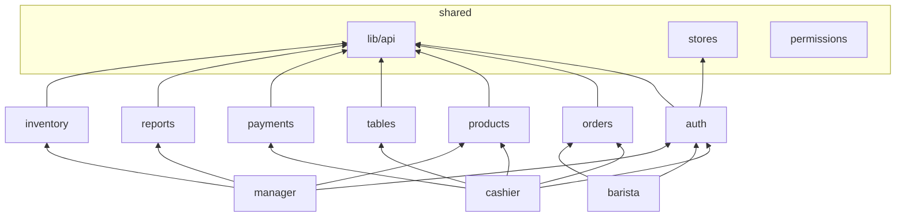
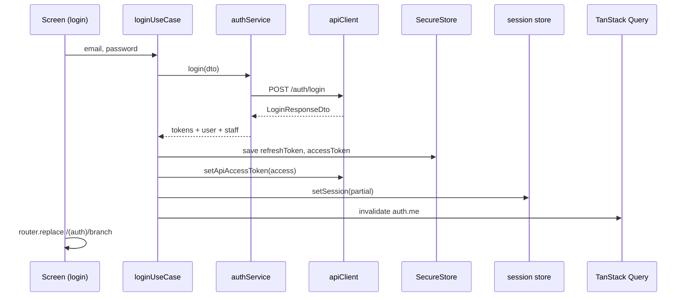

# CaffeApp — Mobile Architecture

**Version:** 1.1.0  
**Nguồn nghiệp vụ:** [STAKEHOLDER_QUESTIONNAIRE.md](STAKEHOLDER_QUESTIONNAIRE.md) · [DEVICE_POLICY.md](DEVICE_POLICY.md)

### Trạng thái implementation (2026-06-29)

| Area                         | Doc    | Code hiện tại                                              |
| ---------------------------- | ------ | ---------------------------------------------------------- |
| Route files (`src/app/`)     | §2, §3 | ✅ Routes cashier/barista/manager — ⏳ **station shell** (GAP-11, P2-03b) |
| `QueryProvider`              | §2     | ✅ Mounted ở root `_layout.tsx`                            |
| `AuthProvider`, guards       | §3     | ✅ Implemented — cần E2E thiết bị thật (C-15)              |
| Station tablet tabs          | §3     | ✅ P2-03b — `(station)/` Thu ngân + Bếp                    |
| Feature hooks / use-cases    | §4     | ⏳ In progress (Sprint 2+)                                 |
| Services (`shared/lib/api/`) | §6     | ⚠️ Partial                                                 |
| SecureStore                  | §6     | ✅ Wired — verify kill app (C-15)                          |
| Routing                      | §3     | ✅ P2-01 route theo `StaffRole` — station cần shell `isStationDevice` |

---

## 1. Clean Architecture — Layer mapping

```
┌─────────────────────────────────────────────────────────────────────────┐
│  FRAMEWORKS & DRIVERS (outermost)                                       │
│  Expo Router · React Native · Axios · TanStack Query · SecureStore      │
├─────────────────────────────────────────────────────────────────────────┤
│  INTERFACE ADAPTERS                                                     │
│  Screens (thin) · Presenters (feature hooks) · API Services · Mappers   │
├─────────────────────────────────────────────────────────────────────────┤
│  USE CASES (application business rules — orchestration only on mobile)  │
│  feature/use-cases/ · mutation orchestrators · permission gates          │
├─────────────────────────────────────────────────────────────────────────┤
│  ENTITIES (innermost — shared, no framework imports)                    │
│  @caffeapp/shared: DTOs · enums · domain types · permission matrix      │
└─────────────────────────────────────────────────────────────────────────┘

Dependency rule: outer → inner only. Entities never import React/Axios.
```

| Clean layer            | Mobile location                        | Trách nhiệm                           |
| ---------------------- | -------------------------------------- | ------------------------------------- |
| **Entities**           | `@caffeapp/shared`                     | DTO, enum, `StaffRole`, contracts     |
| **Use Cases**          | `features/*/use-cases/`                | Orchestrate 1 user action; no UI      |
| **Interface Adapters** | `features/*/hooks/`, `shared/lib/api/` | Gọi API, map response → view model    |
| **Presentation**       | `app/`, `shared/components/ui/`        | Render; **không** gọi Axios trực tiếp |
| **Infrastructure**     | `shared/lib/`, `shared/providers/`     | HTTP client, storage, query client    |

**Nguyên tắc mobile:**

- Business rules **authoritative** nằm ở NestJS API — mobile chỉ **reflect** + **gate UX**
- Mobile use-cases = orchestration (login flow, checkout flow), không duplicate server rules
- Screens ≤ 100 LOC; logic → hooks/use-cases

---

## 2. Folder Tree (target)

```
apps/mobile/
├── app.json
├── babel.config.js
├── metro.config.js
├── tsconfig.json
└── src/
    │
    ├── app/                              # PRESENTATION — Expo Router (thin routes)
    │   ├── _layout.tsx                   # Root: providers, auth guard shell
    │   ├── index.tsx                     # Entry redirect by session
    │   ├── (auth)/
    │   │   ├── _layout.tsx
    │   │   ├── login.tsx
    │   │   ├── branch.tsx
    │   │   └── role.tsx
    │   ├── (cashier)/
    │   │   ├── _layout.tsx               # Role guard
    │   │   ├── (tabs)/
    │   │   │   ├── _layout.tsx
    │   │   │   ├── home.tsx
    │   │   │   ├── orders.tsx
    │   │   │   └── settings.tsx
    │   │   └── order-type.tsx            # Modal/stack screen
    │   ├── (barista)/
    │   │   ├── _layout.tsx
    │   │   ├── queue.tsx
    │   │   └── settings.tsx
    │   └── (manager)/
    │       ├── _layout.tsx
    │       ├── dashboard.tsx
    │       └── settings.tsx
    │
    ├── features/                         # APPLICATION — bounded contexts
    │   ├── README.md
    │   ├── index.ts
    │   │
    │   ├── auth/
    │   │   ├── README.md
    │   │   ├── index.ts                  # Public exports only
    │   │   ├── hooks/
    │   │   │   ├── useLogin.ts
    │   │   │   ├── useLogout.ts
    │   │   │   ├── useMe.ts
    │   │   │   └── index.ts
    │   │   ├── use-cases/
    │   │   │   ├── loginUseCase.ts
    │   │   │   ├── restoreSessionUseCase.ts
    │   │   │   └── index.ts
    │   │   ├── api/
    │   │   │   └── authApi.ts            # Thin wrapper over shared service
    │   │   └── types/
    │   │       └── index.ts
    │   │
    │   ├── cashier/
    │   │   ├── hooks/
    │   │   ├── use-cases/
    │   │   └── types/
    │   │
    │   ├── barista/
    │   ├── manager/
    │   ├── orders/
    │   │   ├── hooks/
    │   │   │   ├── useOrders.ts
    │   │   │   ├── useOrder.ts
    │   │   │   ├── useCreateOrder.ts
    │   │   │   └── useUpdateOrderStatus.ts
    │   │   ├── use-cases/
    │   │   │   ├── createOrderUseCase.ts
    │   │   │   └── cancelOrderUseCase.ts
    │   │   └── api/
    │   │       └── ordersApi.ts
    │   │
    │   ├── products/                     # Sprint 2+
    │   ├── tables/
    │   ├── payments/
    │   ├── reports/
    │   └── inventory/                  # Sprint 4+
    │
    └── shared/                           # INFRASTRUCTURE + cross-cutting
        ├── index.ts
        │
        ├── components/
        │   └── ui/                       # Design system (dumb components)
        │       ├── Button.tsx
        │       ├── Card.tsx
        │       ├── EmptyState.tsx
        │       ├── ErrorState.tsx
        │       ├── Skeleton.tsx
        │       └── index.ts
        │
        ├── config/
        │   ├── api.config.ts             # base URL, endpoints, timeouts
        │   ├── query.config.ts           # staleTime, gcTime per domain
        │   └── permissions.config.ts     # RBAC matrix (UX gates)
        │
        ├── lib/
        │   ├── api/                      # DATA — HTTP service layer
        │   │   ├── apiClient.ts          # Axios instance + interceptors
        │   │   ├── authService.ts
        │   │   ├── orderService.ts
        │   │   ├── productService.ts
        │   │   ├── tableService.ts
        │   │   ├── paymentService.ts
        │   │   ├── reportService.ts
        │   │   ├── inventoryService.ts
        │   │   └── index.ts
        │   │
        │   ├── storage/
        │   │   ├── secureStorage.ts      # Expo SecureStore adapter
        │   │   ├── tokenStorage.ts
        │   │   ├── offlineQueue.ts       # Sprint 3+
        │   │   └── index.ts
        │   │
        │   ├── errors/
        │   │   ├── ApiError.ts           # Typed error from ApiErrorDto
        │   │   ├── mapAxiosError.ts
        │   │   └── index.ts
        │   │
        │   └── network/
        │       ├── networkStatus.ts        # NetInfo wrapper
        │       └── index.ts
        │
        ├── providers/
        │   ├── QueryProvider.tsx
        │   ├── AuthProvider.tsx          # Session bootstrap (Sprint 1)
        │   └── index.ts
        │
        ├── stores/                       # LOCAL UI STATE only (Zustand)
        │   ├── session.ts
        │   ├── cart.ts                   # Sprint 2 — draft order items
        │   ├── ui.ts                     # modals, toasts flags
        │   └── index.ts
        │
        ├── hooks/                        # Cross-feature hooks
        │   ├── usePermission.ts
        │   ├── useNetworkStatus.ts
        │   └── index.ts
        │
        ├── navigation/
        │   ├── guards/
        │   │   ├── AuthGuard.tsx
        │   │   └── RoleGuard.tsx
        │   └── linking.ts
        │
        └── types/
            └── index.ts
```

### Import boundaries

```
app/           → features/*, shared/*, @caffeapp/shared
features/*     → shared/lib/*, @caffeapp/shared, features/*/ (same feature only)
shared/        → @caffeapp/shared, shared/* (no features/)
shared/lib/api → axios, @caffeapp/shared only
```

| ❌ Cấm                           | ✅ Thay bằng                          |
| -------------------------------- | ------------------------------------- |
| `app/` gọi `apiClient` trực tiếp | Feature hook                          |
| Feature A import Feature B       | `@shared/lib/api` hoặc shared store   |
| Service import Zustand           | Hook/use-case inject token            |
| Entity import React              | Giữ entities trong `@caffeapp/shared` |

---

## 3. Navigation Tree

Expo Router file-based routing. **3 role stacks** sau auth.

```
/  (index)
│
├── [unauthenticated]
│   └── (auth)/
│       ├── login          /(auth)/login
│       ├── branch         /(auth)/branch
│       └── role           /(auth)/role
│
├── [role = cashier]
│   └── (cashier)/
│       ├── (tabs)/
│       │   ├── home       /(cashier)/(tabs)/home
│       │   ├── orders     /(cashier)/(tabs)/orders
│       │   └── settings   /(cashier)/(tabs)/settings
│       └── order-type     /(cashier)/order-type
│
├── [role = barista]
│   └── (barista)/
│       ├── queue          /(barista)/queue
│       └── settings       /(barista)/settings
│
├── [isStationDevice = true]  ← P2-03b (target)
│   └── (station)/
│       ├── (tabs)/
│       │   ├── front        Tab Thu ngân → reuse (cashier) flows
│       │   └── kitchen      Tab Bếp → reuse (barista)/queue + order/[id]
│       └── … shared stacks (cart, payment, order detail)
│
└── [role = manager]
    └── (manager)/
        ├── dashboard      /(manager)/dashboard
        └── settings       /(manager)/settings
```

### Navigation flow diagram

```mermaid
flowchart TD
    A[App Launch] --> B{SecureStore có token?}
    B -->|No| C[/(auth)/login]
    B -->|Yes| D[restoreSessionUseCase]
    D -->|Invalid| C
    D -->|Valid| E{activeRole?}
    C --> F[POST /auth/login]
    F --> G[/(auth)/branch]
    G --> H[/(auth)/role]
    H --> I{Chọn role}
    I -->|cashier| J[/(cashier)/(tabs)/home]
    I -->|barista| K[/(barista)/queue]
    I -->|manager| L[/(manager)/dashboard]
    E -->|cashier| J
    E -->|barista| K
    E -->|manager| L
    E -->|null| H
```

### Guard strategy (per layout) — Sprint 1 target

| Layout                  | Guard                              | Hành vi                               | Status                         |
| ----------------------- | ---------------------------------- | ------------------------------------- | ------------------------------ |
| `app/_layout.tsx`       | —                                  | Mount `QueryProvider`, `AuthProvider` | Partial (`QueryProvider` only) |
| `app/index.tsx`         | Session redirect                   | Redirect theo `StaffRole` (không `activeRole`) | ⚠️ Refactor C-11 |
| `(auth)/_layout.tsx`    | Guest only                         | Authenticated → redirect `index`      | ⏳ Sprint 1                    |
| `(cashier)/_layout.tsx` | `RoleGuard(['cashier','manager'])` | Sai role → `index`                    | ⏳ Sprint 1                    |
| `(barista)/_layout.tsx` | `RoleGuard(['barista','manager'])` | Sai role → `index`                    | ⏳ Sprint 1                    |
| `(manager)/_layout.tsx` | `RoleGuard(['manager'])`           | Sai role → `index`                    | ⏳ Sprint 1                    |

> Mobile `Role` type: `'cashier' | 'barista' | 'manager'` (lowercase UX).  
> API `StaffRole`: `OWNER | MANAGER | CASHIER | BARISTA`. Mapping: `@caffeapp/shared/domain`.

**Deep linking (Sprint 2+):** `caffeapp://order/{orderId}` → resolve role + navigate.

---

## 4. Feature Tree

Bounded contexts map 1:1 với API modules + mobile UX flows.

```
features/
│
├── auth                    # Identity & session
│   ├── depends: shared/lib/api, shared/stores/session, shared/lib/storage
│   └── exports: useLogin, useLogout, useMe, restoreSessionUseCase
│
├── cashier                 # POS flow (cashier role UX)
│   ├── depends: orders, products, tables, payments, auth
│   └── exports: useCashierHome, useOrderTypeSelection
│
├── barista                 # Kitchen queue UX
│   ├── depends: orders
│   └── exports: useBaristaQueue, useUpdateOrderStatus
│
├── manager                 # Dashboard & quản lý UX (MANAGER/OWNER)
│   ├── depends: reports, products, staff, inventory
│   └── exports: useDashboard, useRevenueReport
│
├── orders                  # Core domain — shared by cashier/barista
│   ├── depends: shared/lib/api/orderService
│   └── exports: useOrders, useCreateOrder, useCancelOrder
│
├── products                # Menu catalog
├── tables                  # Floor plan
├── payments                # Checkout
├── reports                 # Read-only aggregates
└── inventory               # Stock management (manager)
```

### Feature dependency graph



### Feature module template

```
features/<name>/
├── README.md
├── index.ts              # Barrel — chỉ export public API
├── hooks/                # TanStack Query hooks (presenters)
├── use-cases/            # Orchestration (optional per action)
├── api/                  # Feature-specific API if not in shared/lib/api
└── types/                # View models (không duplicate DTO)
```

---

## 5. State Tree

Phân tách rõ **3 loại state** theo Clean Architecture.

```
STATE
│
├── 1. SERVER STATE (TanStack Query)     ← source of truth từ API
│   ├── auth.me
│   ├── branches.list
│   ├── products.list / products.detail
│   ├── tables.list
│   ├── orders.list / orders.detail / orders.queue
│   ├── payments.byOrder
│   ├── reports.revenue
│   └── inventory.items / inventory.alerts
│
├── 2. CLIENT SESSION STATE (Zustand)    ← persist SecureStore
│   ├── session
│   │   ├── isAuthenticated
│   │   ├── accessToken          (mirror — canonical in SecureStore)
│   │   ├── refreshToken         (SecureStore only, not in Zustand)
│   │   ├── activeBranchId
│   │   ├── activeRole           (mobile Role: cashier|barista|manager)
│   │   └── employeeName
│   └── ui (ephemeral)
│       ├── isGlobalLoading
│       └── activeModal
│
└── 3. EPHEMERAL / FORM STATE (local)    ← useState trong screen hoặc Zustand
    ├── cart.draftItems            # Draft order trước submit
    ├── login.form                 # email/password input
    └── filters                    # search, date range (manager)
```

### State ownership matrix

| Data           | Owner                  | Persist                        | Invalidate khi            |
| -------------- | ---------------------- | ------------------------------ | ------------------------- |
| Orders list    | TanStack Query         | Memory + disk cache (optional) | create/update/cancel      |
| Product menu   | TanStack Query         | `staleTime: 5min`              | manager edits menu        |
| Session tokens | SecureStore            | Device                         | logout / 401 refresh fail |
| Active role    | Zustand + AsyncStorage | Session                        | user chọn role mới        |
| Cart draft     | Zustand                | Memory only                    | order created / cancel    |
| Barista queue  | TanStack Query         | Memory                         | `refetchInterval: 10s`    |

### Zustand vs TanStack Query — quy tắc

| Dùng Zustand khi                | Dùng TanStack Query khi               |
| ------------------------------- | ------------------------------------- |
| Auth session flags              | Data từ REST API                      |
| UI toggles, wizard step         | Cần cache, dedupe, background refetch |
| Optimistic cart draft           | Pagination, infinite scroll           |
| Role/branch selection (pre-API) | Mutation + invalidation               |

**Không** lưu server entities trong Zustand.

---

## 6. Service Layer

HTTP services = **Interface Adapters** — gọi API, trả DTO thuần.

### Cấu trúc

```
shared/lib/api/
├── apiClient.ts          # Singleton Axios
├── authService.ts        # 1 service per API domain
├── orderService.ts
└── index.ts
```

### Service contract pattern

```typescript
// Mỗi service = object với methods map 1:1 API Contract endpoints
export const orderService = {
  list(params: ListOrdersQueryDto): Promise<PaginatedResponse<OrderDto>>,
  getById(id: string): Promise<OrderDto>,
  create(dto: CreateOrderDto): Promise<OrderDto>,
  updateStatus(id: string, dto: UpdateOrderStatusDto): Promise<OrderDto>,
  cancel(id: string, dto: CancelOrderRequestDto): Promise<OrderDto>,
};
```

### Trách nhiệm từng tầng

| Tầng         | File                                 | Làm gì                                   | Không làm gì                      |
| ------------ | ------------------------------------ | ---------------------------------------- | --------------------------------- |
| **Service**  | `*Service.ts`                        | HTTP call, unwrap `{ data }` envelope    | UI state, navigation              |
| **Mapper**   | `shared/lib/errors/mapAxiosError.ts` | Axios → `ApiError`                       | Business validation               |
| **Use-case** | `features/*/use-cases/`              | Orchestrate multi-step (login→store→nav) | Render JSX                        |
| **Hook**     | `features/*/hooks/`                  | TanStack Query wiring                    | Direct SecureStore (qua use-case) |

### Service registry

| Service            | API prefix           | Sprint |
| ------------------ | -------------------- | ------ |
| `authService`      | `/api/v1/auth`       | 1      |
| `userService`      | `/api/v1/users`      | 3      |
| `staffService`     | `/api/v1/staff`      | 3      |
| `productService`   | `/api/v1/products`   | 2      |
| `categoryService`  | `/api/v1/categories` | 2      |
| `tableService`     | `/api/v1/tables`     | 2      |
| `orderService`     | `/api/v1/orders`     | 2      |
| `paymentService`   | `/api/v1/payments`   | 2      |
| `reportService`    | `/api/v1/reports`    | 3      |
| `inventoryService` | `/api/v1/inventory`  | 4      |

---

## 7. TanStack Query Layer

Server state cache — sits between hooks (presentation) and services (data).

### Query key factory

```typescript
// shared/config/query.config.ts (design)
export const queryKeys = {
  auth: {
    all: ['auth'] as const,
    me: () => [...queryKeys.auth.all, 'me'] as const,
  },
  orders: {
    all: ['orders'] as const,
    lists: () => [...queryKeys.orders.all, 'list'] as const,
    list: (filters: ListOrdersQueryDto) => [...queryKeys.orders.lists(), filters] as const,
    details: () => [...queryKeys.orders.all, 'detail'] as const,
    detail: (id: string) => [...queryKeys.orders.details(), id] as const,
    queue: () => [...queryKeys.orders.all, 'queue'] as const,
  },
  products: {
    all: ['products'] as const,
    list: (filters?: ListProductsQueryDto) => [...queryKeys.products.all, 'list', filters] as const,
  },
  // tables, payments, reports, inventory ...
};
```

### Default options (global)

| Option                 | Value                     | Lý do                       |
| ---------------------- | ------------------------- | --------------------------- |
| `staleTime`            | 30_000 ms                 | Giảm request lặp            |
| `gcTime`               | 5 * 60_000 ms             | Giữ cache khi navigate back |
| `retry`                | 1                         | POS cần fail fast           |
| `refetchOnWindowFocus` | `true` (mobile: AppState) | Sync khi quay lại app       |
| `refetchOnReconnect`   | `true`                    | Sau mất mạng                |

### Per-domain overrides

| Query           | staleTime | refetchInterval | Ghi chú                      |
| --------------- | --------- | --------------- | ---------------------------- |
| `orders.queue`  | 0         | 10_000 ms       | Barista real-time substitute |
| `tables.list`   | 15_000    | 30_000 ms       | Floor status                 |
| `products.list` | 300_000   | —               | Menu ít đổi                  |
| `reports.*`     | 60_000    | —               | Manager dashboard            |
| `auth.me`       | 60_000    | —               | Session validation           |

### Mutation pattern

```typescript
// Design pattern — features/orders/hooks/useCreateOrder.ts
useMutation({
  mutationFn: (dto) => createOrderUseCase(dto),
  onSuccess: (order) => {
    queryClient.invalidateQueries({ queryKey: queryKeys.orders.lists() });
    queryClient.setQueryData(queryKeys.orders.detail(order.id), order);
    // tables.list invalidate if DINE_IN
  },
  onError: (error: ApiError) => {
    /* surfaced to UI via mutation state */
  },
});
```

### Hook naming convention

| Pattern        | Ví dụ                  | Returns           |
| -------------- | ---------------------- | ----------------- |
| `useXxx`       | `useOrders`            | `useQuery` result |
| `useXxx`       | `useOrder(id)`         | single entity     |
| `useCreateXxx` | `useCreateOrder`       | `useMutation`     |
| `useUpdateXxx` | `useUpdateOrderStatus` | `useMutation`     |

---

## 8. Axios Layer

Single `apiClient` instance — mọi service dùng chung interceptors.

### Request pipeline

```
Screen → Hook → Service → apiClient
                              │
                    ┌─────────┴─────────┐
                    │ request interceptor│
                    │ · attach Bearer    │
                    │ · X-Request-Id     │
                    │ · branch header*   │
                    └─────────┬─────────┘
                              ▼
                         NestJS API
                              │
                    ┌─────────┴─────────┐
                    │ response interceptor│
                    │ · unwrap envelope  │
                    │ · 401 → refresh    │
                    │ · map ApiError     │
                    └───────────────────┘
```

### Configuration

| Setting   | Source                | Default                 |
| --------- | --------------------- | ----------------------- |
| `baseURL` | `EXPO_PUBLIC_API_URL` | `http://localhost:3000` |
| `timeout` | `API_TIMEOUT_MS`      | 15_000 ms               |
| `prefix`  | services              | `/api/v1/*`             |

### Interceptors design

**Request:**

1. Đọc `accessToken` từ memory (sync với `setApiAccessToken` sau login/restore)
2. `Authorization: Bearer {token}`
3. `X-Request-Id: uuid` (tracing)

**Response — success:**

- Unwrap `{ data }` envelope tại service level (không trong interceptor — giữ interceptor thin)

**Response — error:**

| Status  | Handler                                                                           |
| ------- | --------------------------------------------------------------------------------- |
| `401`   | Attempt refresh → retry original request once → fail → `clearSession` + nav login |
| `403`   | `ApiError` + optional toast "Không có quyền"                                      |
| `409`   | Pass to mutation error (business conflict)                                        |
| `5xx`   | `ApiError` + retry eligible for GET only                                          |
| Network | `ApiError` code `NETWORK_ERROR`                                                   |

### Token refresh queue (Sprint 1)

```
401 received
  → isRefreshing?
      yes → queue request, wait for new token
      no  → POST /auth/refresh
              success → update tokens, retry queue
              fail    → logout, reject all
```

### Android emulator

`EXPO_PUBLIC_API_URL=http://10.0.2.2:3000` — document in `.env.example`.

---

## 9. Authentication Flow

### Sequence diagram



### Token storage

| Key                       | Storage     | Content                         |
| ------------------------- | ----------- | ------------------------------- |
| `@caffeapp/access_token`  | SecureStore | JWT access                      |
| `@caffeapp/refresh_token` | SecureStore | JWT refresh                     |
| `@caffeapp/session_meta`  | SecureStore | `{ branchId, role, name }` JSON |

### Session restore (cold start)

```
App launch
  → AuthProvider.useEffect
  → restoreSessionUseCase()
      → read SecureStore
      → setApiAccessToken
      → GET /auth/me (validate)
      → success: hydrate Zustand → index redirect
      → fail: clear SecureStore → /(auth)/login
```

### Role selection flow

```
Login success → branch screen (nếu staff.branchId null hoặc multi-branch OWNER)
             → role screen (map StaffRole → mobile Role)
             → persist session_meta
             → navigate role home
```

**OWNER:** API `StaffRole.OWNER` → mobile route `(manager)` với extended permissions.

### Logout flow

```
useLogout.mutate()
  → POST /auth/logout (refresh token)
  → SecureStore.clear()
  → setApiAccessToken(null)
  → session.clearSession()
  → queryClient.clear()
  → router.replace /(auth)/login
```

---

## 10. Offline Strategy

**Pilot policy (B-18):** Mất mạng → **app không vận hành**; quán xử lý thủ công. Không offline queue MVP.

### Connectivity

| Tier         | UX                                  |
| ------------ | ----------------------------------- |
| **Online**   | Normal                              |
| **Degraded** | Banner "Kết nối chậm"; polling fallback (F-16) |
| **Offline**  | Thông báo lỗi; **không** queue đơn  |

### Phase rollout

| Sprint | Capability                                       |
| ------ | ------------------------------------------------ |
| 1–3    | NetInfo banner; block mutations khi offline      |
| 2      | Cache `products`, `tables` (read-only, online)   |
| 4+     | WS reconnect; **không** offline-first sync       |

> Nháp giỏ **trước gửi bếp** được lưu local (D-30) — khác offline order sync.

### Offline read cache

```typescript
// Design: PersistQueryClientProvider (Sprint 2+)
persistQueryClient({
  queryClient,
  persister: createAsyncStoragePersister({ storage: AsyncStorage }),
  dehydrateOptions: {
    shouldDehydrateQuery: (q) => ['products', 'tables'].some((k) => q.queryKey.includes(k)),
  },
});
```

### Offline mutation queue

```
User creates order while offline
  → save to offlineQueue (AsyncStorage)
  → optimistic UI: "Đơn chờ đồng bộ"
  → on reconnect: flush queue FIFO
  → conflict (409): show resolution UI
```

### Không cache

- Auth tokens (SecureStore only)
- Payments (must be online Sprint 1–3)
- Reports (manager requires fresh data)

---

## 11. Error Handling

Layered error handling — mỗi layer có trách nhiệm riêng.

```
AxiosError
  → mapAxiosError() → ApiError { statusCode, message, code, details? }
    → useQuery/useMutation → error state
      → Screen → <ErrorState /> | toast | inline field errors
```

### ApiError model

```typescript
// shared/lib/errors/ApiError.ts (design)
class ApiError extends Error {
  statusCode: number;
  code: string; // 'VALIDATION' | 'UNAUTHORIZED' | 'NETWORK_ERROR' | ...
  details?: FieldError[]; // validation fields
  retryable: boolean;
}
```

### Error mapping table

| Source       | statusCode | code            | UI treatment                        |
| ------------ | ---------- | --------------- | ----------------------------------- |
| Validation   | 400        | `VALIDATION`    | Inline field errors                 |
| Unauthorized | 401        | `UNAUTHORIZED`  | Redirect login (after refresh fail) |
| Forbidden    | 403        | `FORBIDDEN`     | ErrorState + back                   |
| Not found    | 404        | `NOT_FOUND`     | EmptyState                          |
| Conflict     | 409        | `CONFLICT`      | Alert with business message         |
| Network      | —          | `NETWORK_ERROR` | ErrorState + retry button           |
| Timeout      | —          | `TIMEOUT`       | Toast + retry                       |
| Server       | 5xx        | `SERVER_ERROR`  | ErrorState + retry                  |

### Global vs local handling

| Scope    | Handler                       | Ví dụ                       |
| -------- | ----------------------------- | --------------------------- |
| Global   | Axios interceptor             | 401 refresh                 |
| Query    | `throwOnError: false` default | Screen reads `isError`      |
| Mutation | `onError` in hook             | Toast "Thanh toán thất bại" |
| Form     | Map `details[]` → fields      | Login validation            |

### User-facing messages

- **Không** hiển thị raw API message cho 5xx
- Map `ApiError.code` → i18n key `errors.{code}`
- 409: hiển thị `message` từ server (business rule)

### Error UI components

| Component        | Khi dùng                    |
| ---------------- | --------------------------- |
| `<ErrorState />` | Full screen fetch fail      |
| `<EmptyState />` | 404 / empty list            |
| Toast            | Mutation fail, non-blocking |
| Inline text      | Form validation             |

---

## 12. Loading Strategy

### Loading types

| Type                   | Trigger              | UI pattern                      |
| ---------------------- | -------------------- | ------------------------------- |
| **Initial load**       | `isLoading && !data` | Full screen `<Skeleton />`      |
| **Background refetch** | `isFetching && data` | Subtle pull indicator / opacity |
| **Mutation**           | `isPending`          | Button disabled + spinner       |
| **Auth bootstrap**     | `isRestoringSession` | Splash / blank với logo         |
| **Infinite scroll**    | `isFetchingNextPage` | Footer skeleton                 |

### Screen loading contract

```typescript
// Design pattern for screens
const { data, isLoading, isError, error, refetch, isFetching } = useOrders();

if (isLoading) return <OrdersSkeleton />;
if (isError) return <ErrorState error={error} onRetry={refetch} />;
if (!data?.length) return <EmptyState />;

return (
  <>
    {isFetching && <RefreshingIndicator />}
    <OrdersList data={data} />
  </>
);
```

### Global loading

- **Không** dùng global blocking spinner cho mọi query
- Chỉ `AuthProvider` bootstrap và critical mutations (payment) dùng overlay

### Skeleton mapping

| Screen        | Skeleton                               |
| ------------- | -------------------------------------- |
| Product grid  | `Skeleton.Card` × 6                    |
| Order list    | `Skeleton.Row` × 8                     |
| Dashboard     | `Skeleton.Chart` + `Skeleton.Stat` × 4 |
| Barista queue | `Skeleton.OrderCard` × 5               |

### Mutation feedback

| Action                  | Loading        | Success              | Error  |
| ----------------------- | -------------- | -------------------- | ------ |
| Login                   | Button spinner | Navigate             | Inline |
| Create order            | Button spinner | Navigate + toast     | Toast  |
| Payment                 | Full overlay   | Receipt + navigate   | Alert  |
| Update status (barista) | Swipe disable  | Haptic + list update | Toast  |

---

## 13. Permission Strategy

Mobile permissions = **UX gates only**. Security enforced at API (403).

### Role model

```
API StaffRole (canonical)     Mobile Role (routing)
─────────────────────────     ─────────────────────
OWNER                    →    manager (+ owner flag in session)
MANAGER                  →    manager
CASHIER                  →    cashier
BARISTA                  →    barista
```

### Permission config

```typescript
// shared/config/permissions.config.ts (design)
export const PERMISSIONS = {
  'orders:create': ['cashier', 'manager'],
  'orders:pay': ['cashier', 'manager'],
  'orders:cancel': ['cashier', 'manager'],
  'orders:status': ['cashier', 'barista', 'manager'],
  'orders:queue:view': ['barista', 'manager'],
  'menu:manage': ['manager'],
  'tables:manage': ['manager'],
  'reports:view': ['manager'],
  'inventory:manage': ['manager'],
  'staff:manage': ['manager'], // OWNER only at API
} as const;
```

### usePermission hook

```typescript
// shared/hooks/usePermission.ts (design)
function usePermission(action: PermissionAction): boolean {
  const activeRole = useSessionStore((s) => s.activeRole);
  return activeRole ? PERMISSIONS[action].includes(activeRole) : false;
}

// Screen usage
const canPay = usePermission('orders:pay');
{canPay && <PayButton />}
```

### 3-layer permission enforcement

```
Layer 1: Navigation guard     RoleGuard on (cashier)|(barista)|(manager)
Layer 2: UI conditional       usePermission() hide/disable
Layer 3: API                  403 Forbidden → ErrorState
```

### Permission matrix (mobile UX)

| Action            | cashier | barista | manager |
| ----------------- | ------- | ------- | ------- |
| View menu         | ✓       | ✓       | ✓       |
| Create order      | ✓       | —       | ✓       |
| Barista queue     | —       | ✓       | ✓       |
| Process payment   | ✓       | —       | ✓       |
| Cancel order      | ✓       | —       | ✓       |
| Dashboard         | —       | —       | ✓       |
| Manage menu       | —       | —       | ✓       |
| Inventory         | —       | —       | ✓       |
| Settings / logout | ✓       | ✓       | ✓       |

### Branch scope

- `activeBranchId` trong session → filter query params implicit (API scopes by JWT)
- UI hiển thị branch name từ `auth.me` query

---

## 14. Data flow (end-to-end example)

**Cashier tạo đơn — Clean Architecture flow:**

```
1. PRESENTATION  order-type.tsx
      │ user taps "Tại bàn"
      ▼
2. HOOK          useCreateOrder() — useMutation
      ▼
3. USE CASE      createOrderUseCase({ orderType, tableId, items })
      │ · validate cart not empty (client guard)
      │ · call orderService.create(dto)
      ▼
4. SERVICE       orderService → apiClient POST /orders
      ▼
5. API           NestJS validates + business rules
      ▼
6. RESPONSE      OrderDto → mutation onSuccess
      │ · invalidate orders.list, tables.list
      │ · clear cart store
      ▼
7. PRESENTATION  router.push orders detail
```

---

## 15. Sprint alignment

| Sprint | Mobile architecture deliverables                            |
| ------ | ----------------------------------------------------------- |
| **1**  | Auth, SecureStore, AuthProvider; routing StaffRole; **tablet trạm tabs (P2-03b)** |
| **2**  | orders/products/tables hooks, cart draft persist (D-30)             |
| **3**  | payments TM/CK, reports hooks                                       |
| **4**  | WebSocket barista; polling fallback — **no offline queue**          |

---

## 16. Related documents

| Doc                                                         | Content                  |
| ----------------------------------------------------------- | ------------------------ |
| [API_CONTRACT.md](api/API_CONTRACT.md)                      | REST endpoints + DTOs    |
| [CONVENTIONS.md](CONVENTIONS.md)                            | Aliases, imports         |
| [ARCHITECTURE.md](ARCHITECTURE.md)                          | System-wide architecture |
| [features/README.md](../apps/mobile/src/features/README.md) | Feature module template  |

---

## 17. Checklist — implementation readiness

- [ ] `shared/lib/storage/secureStorage.ts` + `tokenStorage.ts`
- [ ] `shared/lib/errors/` + `mapAxiosError`
- [ ] `shared/config/query.config.ts` + query key factory
- [ ] `shared/config/permissions.config.ts` + `usePermission`
- [ ] `shared/providers/AuthProvider.tsx`
- [ ] `shared/navigation/guards/`
- [ ] `features/auth/use-cases/` + hooks
- [ ] Axios refresh token interceptor
- [ ] `shared/lib/network/networkStatus.ts` (Sprint 2+)
- [ ] Update root README link to this doc — ✅ Done (2026-06-28)
