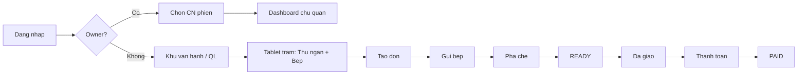
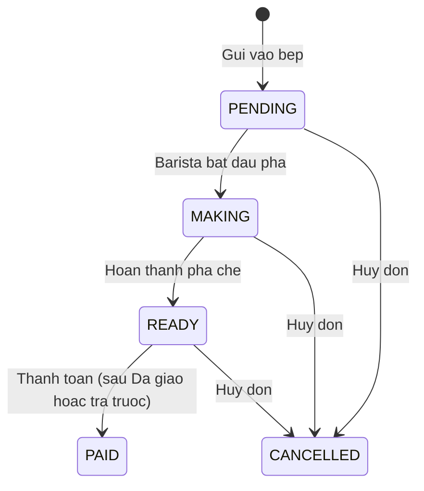

# CaffeApp — Product Requirements Document (PRD)

**Version:** 1.1.0-MVP-v2  
**Last updated:** 2026-07-02  
**Status:** Aligned with [STAKEHOLDER_QUESTIONNAIRE.md](STAKEHOLDER_QUESTIONNAIRE.md)  
**Nguồn quyết định nghiệp vụ:** Questionnaire MVP v2 (Phần A–K)

---

## 1. Tổng quan sản phẩm

**CaffeApp** là ứng dụng mobile quản lý quán cafe nội bộ, phục vụ 3 vai trò trong cùng chi nhánh với đồng bộ đơn hàng real-time.

### Mục tiêu MVP

Cho phép thu ngân tạo và thanh toán đơn, barista nhận và hoàn thành đơn trong < 3s, quản lý xem doanh thu theo ngày/ca.

### Personas

| Persona      | Tuổi  | Thiết bị                       | Kỹ năng tech |
| ------------ | ----- | ------------------------------ | ------------ |
| NV vận hành  | 20–30 | Tablet trạm chung + ĐT cá nhân | Trung bình   |
| QL chi nhánh | 25–35 | ĐT cá nhân                     | Trung bình   |
| Chủ quán     | 30–45 | ĐT cá nhân (đa chi nhánh)      | Trung bình   |

**Quy mô pilot:** 3 chi nhánh · ~50 bàn/CN · 2 NV vận hành/CN (pha + thu ngân).

## 2. User Flow tổng thể

> **Không có màn chọn vai trò** — routing theo `StaffRole` sau login (C-11).  
> Tablet trạm: tab Thu ngân + Bếp; mỗi thao tác chọn tên NV xác nhận (B-15).

---

## 3. State Machine — Đơn hàng

> Enum Prisma: `OrderStatus` = `PENDING | MAKING | READY | PAID | CANCELLED` (không dùng `SERVING`).  
> **Đã giao món:** field `deliveredAt` trên order (B-33, C-14) — không phải status riêng.  
> Trạng thái nháp trước khi gửi bếp (FR-B06) được quản lý ở **client cart**, chưa persist DB.

### State Machine — Bàn

| Status        | Mô tả    | Trigger                            |
| ------------- | -------- | ---------------------------------- |
| `EMPTY`       | Trống    | Không có đơn active                |
| `OCCUPIED`    | Có khách | Đơn PENDING/MAKING/READY chưa PAID |
| `MAINTENANCE` | Bảo trì  | MANAGER/OWNER đặt thủ công         |

Thanh toán được theo dõi qua bảng `payments` và `orders.status = PAID`. Không có enum `payment_status` riêng trên order (MVP).

---

## 4. Functional Requirements theo nhóm màn hình

### Nhóm A — Đăng nhập & Phân quyền (màn 01–04)

| ID     | Requirement                                                                                         | Priority |
| ------ | --------------------------------------------------------------------------------------------------- | -------- |
| FR-A01 | Đăng nhập bằng email/SĐT + mật khẩu                                                                 | Must     |
| FR-A02 | Chọn chi nhánh phiên — **chỉ OWNER** (staff: CN từ assignment)                                      | Must     |
| FR-A03 | Điều hướng theo `StaffRole` sau login — **không** màn chọn vai trò                                  | Must     |
| FR-A04 | Trang chủ trạm vận hành: quick actions + **tab Thu ngân + Tab Bếp** (queue pha, hoàn thành → READY) | Must     |
| FR-A05 | Đăng nhập sinh trắc học (Face ID / fingerprint)                                                     | Could    |

**Business rules:**

- CASHIER/BARISTA/MANAGER: chi nhánh từ `branch_assignment` đã duyệt — không tự chọn CN (BRANCH_ASSIGNMENT.md)
- OWNER: chọn CN phiên để xem báo cáo đa chi nhánh
- Tablet trạm: tài khoản trạm + **chọn tên NV** mỗi thao tác nhạy cảm (audit)
- Tab **Bếp** trên tablet trạm: hoàn thành món (MAKING → READY) trước khi tab Thu ngân hiện "Chờ giao" — TASK-P2-03b
- Session timeout sau 8 giờ hoặc khi kết ca (ĐT cá nhân)

---

### Nhóm B — Thu ngân (màn 05–15)

| ID     | Requirement                                                          | Priority |
| ------ | -------------------------------------------------------------------- | -------- |
| FR-B01 | Chọn loại đơn: tại bàn / mang đi                                     | Must     |
| FR-B02 | Sơ đồ bàn real-time (trống/có khách/đang chọn)                       | Must     |
| FR-B03 | Menu theo danh mục (Cà phê, Trà, Bánh)                               | Must     |
| FR-B04 | Tùy chỉnh món: size, đường, đá, ghi chú                              | Must     |
| FR-B05 | Giỏ hàng: sửa SL, xóa món, ghi chú đơn                               | Must     |
| FR-B06 | Lưu nháp đơn (cart local, chưa gửi bếp)                              | Should   |
| FR-B07 | Gửi vào bếp → status PENDING                                         | Must     |
| FR-B08 | Thanh toán tiền mặt (nhập tiền khách đưa, tính thừa)                 | Must     |
| FR-B09 | Thanh toán chuyển khoản (VietQR + xác nhận thủ công)                 | Must     |
| FR-B10 | Thanh toán thẻ (ghi nhận thủ công, không POS)                        | Could    |
| FR-B11 | Thanh toán ví / cổng: không dùng trong pilot; ưu tiên VietQR cho MVP | Could    |
| FR-B12 | Danh sách đơn đang phục vụ                                           | Must     |
| FR-B13 | Lịch sử đơn trong ca/ngày                                            | Should   |
| FR-B14 | Gộp bàn / chuyển bàn / tách bill theo món                            | Should   |
| FR-B15 | Giảm giá %, số tiền, voucher (một KM/đơn)                            | Should   |

**Business rules:**

- Đơn tại bàn bắt buộc chọn bàn trước khi chọn món
- Đơn mang đi không cần bàn; có số thứ tự #xxx (B-28)
- Giá menu **đã gồm VAT 8%**; bill hiển thị tổng + dòng tách VAT (D-17)
- Thanh toán mặc định khi **READY** (ưu tiên sau **Đã giao**); cho phép trả trước/mang đi (E-01)
- Không gửi bếp nếu giỏ hàng rỗng
- Mọi thao tác gộp/tách/đổi bàn, giảm giá → audit log (B-22)

---

### Nhóm C — Barista (màn 16–19)

| ID     | Requirement                               | Priority |
| ------ | ----------------------------------------- | -------- |
| FR-C01 | Danh sách đơn chờ, sắp xếp theo thời gian | Must     |
| FR-C02 | Đơn ưu tiên (chờ > 5 phút) highlight      | Should   |
| FR-C03 | Xem chi tiết món + ghi chú tùy chỉnh      | Must     |
| FR-C04 | Bắt đầu pha → MAKING                      | Must     |
| FR-C05 | Đánh dấu từng món hoàn thành              | Must     |
| FR-C06 | Hoàn thành đơn → READY, notify thu ngân   | Must     |

**Business rules:**

- Barista chỉ thấy đơn thuộc chi nhánh đang làm việc
- Real-time update < 3s
- Timer đếm từ lúc **MAKING** (F-11)
- Real-time: polling Sprint 2–3; WebSocket Sprint 4 (D-09, F-01)

---

### Nhóm D — Quản lý (màn 20–25)

| ID     | Requirement                        | Priority |
| ------ | ---------------------------------- | -------- |
| FR-D01 | Dashboard doanh thu hôm nay        | Must     |
| FR-D02 | Biểu đồ doanh thu theo giờ         | Must     |
| FR-D03 | Báo cáo doanh thu theo khoảng ngày | Should   |
| FR-D04 | Lịch sử ca làm việc                | Should   |
| FR-D05 | CRUD menu item                     | Should   |
| FR-D06 | Danh sách + chi tiết nhân viên     | Should   |

---

### Nhóm E — Khác (màn 26–28)

| ID     | Requirement                                             | Priority |
| ------ | ------------------------------------------------------- | -------- |
| FR-E01 | Quản lý trạng thái bàn (bao gồm bảo trì)                | Should   |
| FR-E02 | Feed thông báo (đơn xong, cảnh báo)                     | Should   |
| FR-E03 | Cài đặt: thông tin quán, đổi MK qua mã email, đăng xuất | Must     |

---

## 5. Edge Cases

| #     | Scenario                                  | Expected behavior                                             |
| ----- | ----------------------------------------- | ------------------------------------------------------------- |
| EC-01 | Mất mạng khi đang tạo đơn                 | App không hoạt động; vận hành thủ công tại quán (B-18)        |
| EC-02 | Mất mạng barista                          | Cùng EC-01 — không offline queue MVP                          |
| EC-03 | Hủy món trong giỏ (chưa gửi bếp)          | Xóa item, cập nhật tổng                                       |
| EC-04 | Hủy đơn đã gửi bếp                        | Chỉ manager/cashier; confirm dialog; notify barista           |
| EC-05 | Đổi bàn giữa chừng                        | Chỉ khi đơn chưa PAID; release bàn cũ                         |
| EC-06 | 2 thu ngân cùng chọn 1 bàn                | Optimistic lock; báo "Bàn đã được chọn"                       |
| EC-07 | Thanh toán thiếu tiền mặt                 | Disable nút hoàn tất; hiện lỗi                                |
| EC-08 | Chuyển khoản chưa xác nhận                | Đơn READY, chưa PAID; QL xử lý cuối ca nếu chưa vào TK (E-07) |
| EC-09 | Barista hoàn thành khi chưa check hết món | Disable nút "Hoàn thành đơn"                                  |
| EC-10 | Session hết hạn                           | Redirect login; giữ draft local (encrypted)                   |

---

## 6. Non-Functional Requirements (NFR)

| ID     | Category      | Requirement                     |
| ------ | ------------- | ------------------------------- |
| NFR-01 | Performance   | API response p95 < 500ms        |
| NFR-02 | Real-time     | Order event latency < 3s        |
| NFR-03 | Availability  | 99% uptime trong giờ mở cửa     |
| NFR-04 | Security      | JWT HS256, refresh token, RBAC  |
| NFR-05 | Security      | Password bcrypt cost 12         |
| NFR-06 | Accessibility | Touch target ≥ 44px             |
| NFR-07 | Localization  | Tiếng Việt (MVP), chuẩn bị i18n |
| NFR-08 | Platform      | iOS 15+, Android 10+            |

---

## 7. Out of Scope (MVP v1 pilot)

- In hóa đơn nhiệt Bluetooth (bill màn hình pilot)
- Tích điểm khách hàng
- Đa ngôn ngữ
- Offline-first / sync khi mất mạng
- Giao hàng Grab/ShopeeFood (A-08)
- Inventory / kho chi tiết
- Lịch ca nhân viên trên app

## 7.1 In Scope MVP v2 (sau pilot)

- Gộp bàn / chuyển bàn / tách bill (B-30)
- Giảm giá & voucher cơ bản (B-31)
- WebSocket barista + push notification
- Module shift bắt buộc (Sprint 5)
- Audit log trên app (Owner/QL)

## 8. Dependencies

| Dependency                                    | Owner    | Status        |
| --------------------------------------------- | -------- | ------------- |
| PostgreSQL 16 (local/Docker) + Prisma migrate | Tech     | ✅ Done       |
| NestJS API dev environment                    | Tech     | ✅ Done       |
| Apple Developer / Google Play (internal test) | DevOps   | Post Sprint 4 |
| Menu data seed từ chủ quán                    | PO       | Pending       |
| QR bank account (Vietcombank)                 | Chủ quán | Pending       |

---

## 9. Milestones

| Milestone | Sprint     | Deliverable                   |
| --------- | ---------- | ----------------------------- |
| M0        | Sprint 0   | Repo, CI, design system shell |
| M1        | Sprint 1   | Auth flow end-to-end          |
| M2        | Sprint 2–3 | Order + payment core          |
| M3        | Sprint 4   | Barista real-time             |
| M4        | Sprint 5–6 | Manager + UAT pilot           |
