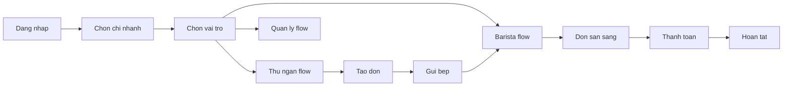
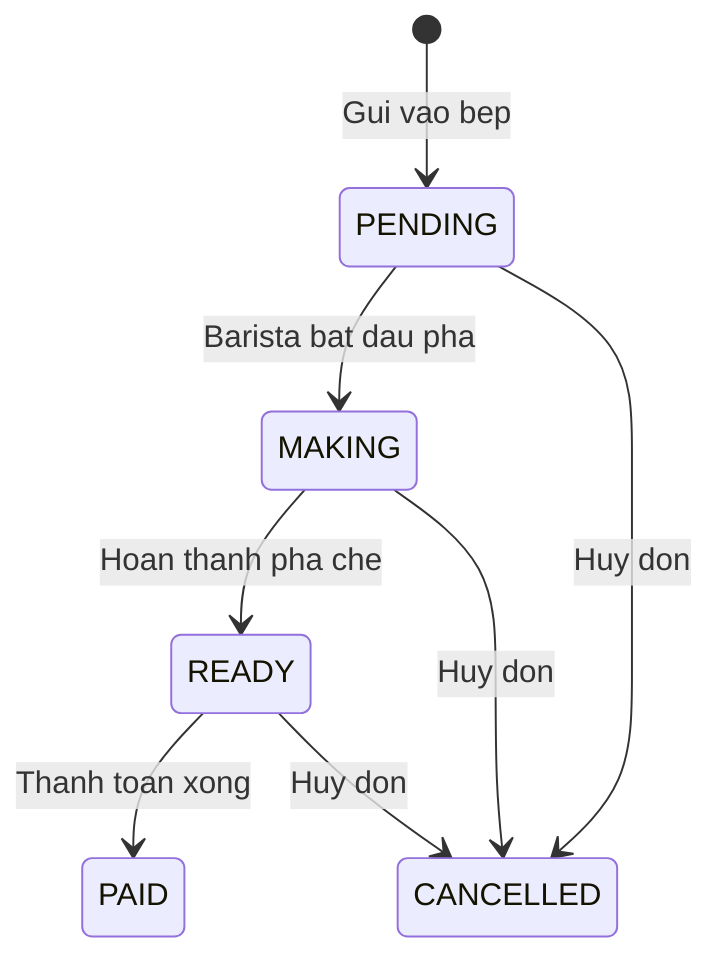

# CaffeApp — Product Requirements Document (PRD)

**Version:** 1.0.0-MVP  
**Last updated:** 2026-06-25  
**Status:** Approved for Sprint 0

---

## 1. Tổng quan sản phẩm

**CaffeApp** là ứng dụng mobile quản lý quán cafe nội bộ, phục vụ 3 vai trò trong cùng chi nhánh với đồng bộ đơn hàng real-time.

### Mục tiêu MVP

Cho phép thu ngân tạo và thanh toán đơn, barista nhận và hoàn thành đơn trong < 3s, quản lý xem doanh thu theo ngày/ca.

### Personas

| Persona       | Tuổi  | Thiết bị             | Kỹ năng tech |
| ------------- | ----- | -------------------- | ------------ |
| Thu ngân Minh | 22–30 | Android tablet/phone | Trung bình   |
| Barista Lan   | 20–28 | Android phone        | Cơ bản       |
| Chủ quán Nam  | 30–45 | iPhone               | Trung bình   |

---

## 2. User Flow tổng thể

---

## 3. State Machine — Đơn hàng

> Enum Prisma: `OrderStatus` = `PENDING | MAKING | READY | PAID | CANCELLED`.  
> Trạng thái nháp trước khi gửi bếp (FR-B06) được quản lý ở **client cart** (Zustand), chưa persist DB.

### State Machine — Bàn

| Status        | Mô tả    | Trigger                             |
| ------------- | -------- | ----------------------------------- |
| `EMPTY`       | Trống    | Không có đơn active                 |
| `OCCUPIED`    | Có khách | Đơn PENDING/MAKING/READY chưa PAID |
| `MAINTENANCE` | Bảo trì  | MANAGER/OWNER đặt thủ công         |

Thanh toán được theo dõi qua bảng `payments` và `orders.status = PAID`. Không có enum `payment_status` riêng trên order (MVP).

---

## 4. Functional Requirements theo nhóm màn hình

### Nhóm A — Đăng nhập & Phân quyền (màn 01–04)

| ID     | Requirement                                              | Priority |
| ------ | -------------------------------------------------------- | -------- |
| FR-A01 | Đăng nhập bằng email/SĐT + mật khẩu                      | Must     |
| FR-A02 | Chọn chi nhánh sau đăng nhập (nếu user có >1 branch)     | Must     |
| FR-A03 | Chọn vai trò làm việc trong ca (CASHIER/BARISTA/MANAGER) | Must     |
| FR-A04 | Trang chủ thu ngân hiển thị quick actions                | Must     |
| FR-A05 | Đăng nhập sinh trắc học (Face ID / fingerprint)          | Could    |

**Business rules:**

- User chỉ thấy chi nhánh được gán trong hệ thống
- Role phải match với quyền user (RBAC)
- Session timeout sau 8 giờ hoặc khi kết ca

---

### Nhóm B — Thu ngân (màn 05–15)

| ID     | Requirement                                          | Priority |
| ------ | ---------------------------------------------------- | -------- |
| FR-B01 | Chọn loại đơn: tại bàn / mang đi                     | Must     |
| FR-B02 | Sơ đồ bàn real-time (trống/có khách/đang chọn)       | Must     |
| FR-B03 | Menu theo danh mục (Cà phê, Trà, Bánh)               | Must     |
| FR-B04 | Tùy chỉnh món: size, đường, đá, ghi chú              | Must     |
| FR-B05 | Giỏ hàng: sửa SL, xóa món, ghi chú đơn               | Must     |
| FR-B06 | Lưu nháp đơn (cart local, chưa gửi bếp)               | Should   |
| FR-B07 | Gửi vào bếp → status PENDING                         | Must     |
| FR-B08 | Thanh toán tiền mặt (nhập tiền khách đưa, tính thừa) | Must     |
| FR-B09 | Thanh toán chuyển khoản (QR + xác nhận)              | Must     |
| FR-B10 | Thanh toán thẻ                                       | Should   |
| FR-B11 | Thanh toán ví điện tử                                | Should   |
| FR-B12 | Danh sách đơn đang phục vụ                           | Must     |
| FR-B13 | Lịch sử đơn trong ca/ngày                            | Should   |

**Business rules:**

- Đơn tại bàn bắt buộc chọn bàn trước khi chọn món
- Đơn mang đi không cần bàn
- Giá = base price × quantity; VAT 8% (configurable)
- Không gửi bếp nếu giỏ hàng rỗng

---

### Nhóm C — Barista (màn 16–19)

| ID     | Requirement                               | Priority |
| ------ | ----------------------------------------- | -------- |
| FR-C01 | Danh sách đơn chờ, sắp xếp theo thời gian | Must     |
| FR-C02 | Đơn ưu tiên (chờ > 5 phút) highlight      | Should   |
| FR-C03 | Xem chi tiết món + ghi chú tùy chỉnh      | Must     |
| FR-C04 | Bắt đầu pha → MAKING                                   | Must     |
| FR-C05 | Đánh dấu từng món hoàn thành              | Must     |
| FR-C06 | Hoàn thành đơn → READY, notify thu ngân   | Must     |

**Business rules:**

- Barista chỉ thấy đơn thuộc chi nhánh đang làm việc
- Real-time update < 3s
- Timer đếm từ lúc PENDING

---

### Nhóm D — Quản lý (màn 20–25)

| ID     | Requirement                        | Priority |
| ------ | ---------------------------------- | -------- |
| FR-D01 | Dashboard doanh thu hôm nay        | Must     |
| FR-D02 | Biểu đồ doanh thu theo giờ         | Must     |
| FR-D03 | Báo cáo doanh thu theo khoảng ngày | Should   |
| FR-D04 | Lịch sử ca làm việc                | Should   |
| FR-D05 | CRUD menu item                     | Should   |
| FR-D06 | Danh sách + chi tiết nhân viên     | Should   |

---

### Nhóm E — Khác (màn 26–28)

| ID     | Requirement                                | Priority |
| ------ | ------------------------------------------ | -------- |
| FR-E01 | Quản lý trạng thái bàn (bao gồm bảo trì)   | Should   |
| FR-E02 | Feed thông báo (đơn xong, cảnh báo)        | Should   |
| FR-E03 | Cài đặt: thông tin quán, đổi MK, đăng xuất | Must     |

---

## 5. Edge Cases

| #     | Scenario                                  | Expected behavior                                     |
| ----- | ----------------------------------------- | ----------------------------------------------------- |
| EC-01 | Mất mạng khi đang tạo đơn                 | Hiện banner offline; không cho gửi bếp; giữ giỏ local |
| EC-02 | Mất mạng barista                          | Hiện banner; queue cached; sync khi reconnect         |
| EC-03 | Hủy món trong giỏ (chưa gửi bếp)          | Xóa item, cập nhật tổng                               |
| EC-04 | Hủy đơn đã gửi bếp                        | Chỉ manager/cashier; confirm dialog; notify barista   |
| EC-05 | Đổi bàn giữa chừng                        | Chỉ khi đơn chưa PAID; release bàn cũ                 |
| EC-06 | 2 thu ngân cùng chọn 1 bàn                | Optimistic lock; báo "Bàn đã được chọn"               |
| EC-07 | Thanh toán thiếu tiền mặt                 | Disable nút hoàn tất; hiện lỗi                        |
| EC-08 | Chuyển khoản chưa xác nhận                | Đơn READY, payment UNPAID cho đến khi confirm         |
| EC-09 | Barista hoàn thành khi chưa check hết món | Disable nút "Hoàn thành đơn"                          |
| EC-10 | Session hết hạn                           | Redirect login; giữ draft local (encrypted)           |

---

## 6. Non-Functional Requirements (NFR)

| ID     | Category      | Requirement                     |
| ------ | ------------- | ------------------------------- |
| NFR-01 | Performance   | API response p95 < 500ms        |
| NFR-02 | Real-time     | Order event latency < 3s        |
| NFR-03 | Availability  | 99% uptime trong giờ mở cửa     |
| NFR-04 | Security      | JWT HS256, refresh token, RBAC  |
| NFR-05 | Security      | Password bcrypt cost 12         |
| NFR-06 | Accessibility | Touch target ≥ 44px             |
| NFR-07 | Localization  | Tiếng Việt (MVP), chuẩn bị i18n |
| NFR-08 | Platform      | iOS 15+, Android 10+            |

---

## 7. Out of Scope (MVP)

- In hóa đơn nhiệt Bluetooth
- Tích điểm khách hàng
- Đa ngôn ngữ
- Offline-first full sync
- Split bill / gộp bàn

---

## 8. Dependencies

| Dependency                                    | Owner    | Status        |
| --------------------------------------------- | -------- | ------------- |
| PostgreSQL 16 (local/Docker) + Prisma migrate | Tech     | ✅ Done       |
| NestJS API dev environment                    | Tech     | ✅ Done       |
| Apple Developer / Google Play (internal test) | DevOps   | Post Sprint 4 |
| Menu data seed từ chủ quán                    | PO       | Pending       |
| QR bank account (Vietcombank)                 | Chủ quán | Pending       |

---

## 9. Milestones

| Milestone | Sprint     | Deliverable                   |
| --------- | ---------- | ----------------------------- |
| M0        | Sprint 0   | Repo, CI, design system shell |
| M1        | Sprint 1   | Auth flow end-to-end          |
| M2        | Sprint 2–3 | Order + payment core          |
| M3        | Sprint 4   | Barista real-time             |
| M4        | Sprint 5–6 | Manager + UAT pilot           |
